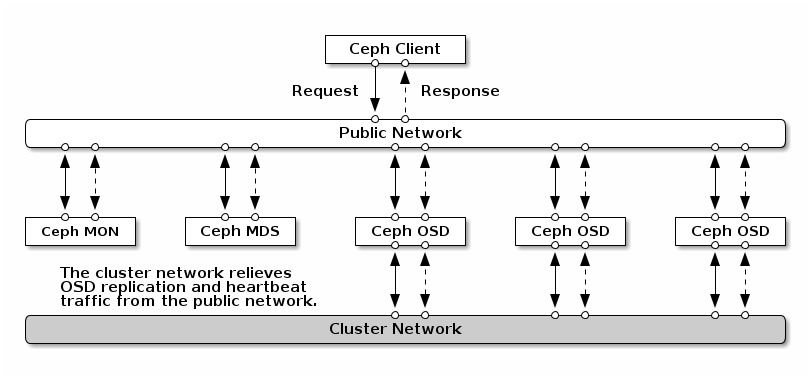

# Install and Using Ceph

## I. Table of contents

- [Install and Using Ceph](#install-and-using-ceph)
  - [I. Table of contents](#i-table-of-contents)
  - [II. Install](#ii-install)
    - [1. Requirement](#1-requirement)
      - [a) Kiến thức](#a-kiến-thức)
      - [b) Cấu hình](#b-cấu-hình)
        - [Disks](#disks)
        - [Networks](#networks)
    - [2. Install](#2-install)
      - [a) Requirement](#a-requirement)
      - [b) Dependencies](#b-dependencies)
      - [c) Download Ceph-ansible](#c-download-ceph-ansible)
      - [d) Config Ceph-ansible](#d-config-ceph-ansible)
      - [e) Deployment](#e-deployment)
  - [III. Fix warning Ceph](#iii-fix-warning-ceph)
  - [References](#references)

## II. Install

### 1. Requirement

#### a) Kiến thức

- Kiến thức cơ bản về `Ansible`
- Kiến thức cơ bản về `Docker`
- Kiến thức cơ bản về `Virtual enviroment` của python

#### b) Cấu hình

|         | Requirements |
|---------|--------------|
| CPU     | 1 cores      |
| Ram     | 1 GB         |
| Disks   | 2 Disks      |
| Network | 2 NICs       |

Ở đây ta sẽ triển khai cả `Ceph MON` và `Ceph OSD` trên cùng 1 node.

##### Disks

Đầu tiên mình sẽ cấu hình disks bằng cách ta sẽ cấp 2 disk cho Ceph và mount vào VM.

Ta kiểm tra ổ đĩa đã mount thành công hay chưa bằng câu lệnh `lsblk`

```s
NAME                                                                   MAJ:MIN RM  SIZE RO TYPE MOUNTPOINT
sda                                                                      8:0    0   60G  0 disk
├─sda1                                                                   8:1    0   59G  0 part /
├─sda2                                                                   8:2    0    1K  0 part
└─sda5                                                                   8:5    0  975M  0 part [SWAP]
sdb                                                                      8:16   0   20G  0 disk
├─cinder--volumes-cinder--volumes--pool_tmeta                          254:0    0   20M  0 lvm
│ └─cinder--volumes-cinder--volumes--pool-tpool                        254:2    0   19G  0 lvm
│   ├─cinder--volumes-cinder--volumes--pool                            254:3    0   19G  0 lvm
│   └─cinder--volumes-volume--51996882--8407--4c2c--9db0--cb9a7bbcbd67 254:4    0    1G  0 lvm
└─cinder--volumes-cinder--volumes--pool_tdata                          254:1    0   19G  0 lvm
  └─cinder--volumes-cinder--volumes--pool-tpool                        254:2    0   19G  0 lvm
    ├─cinder--volumes-cinder--volumes--pool                            254:3    0   19G  0 lvm
    └─cinder--volumes-volume--51996882--8407--4c2c--9db0--cb9a7bbcbd67 254:4    0    1G  0 lvm
sdc                                                                      8:32   0   10G  0 disk
sdd                                                                      8:48   0   10G  0 disk
sr0                                                                     11:0    1 1024M  0 rom
```

Ổ đĩa đã được mount thành công với tên `sdc` và `sdd` có size là 10GB. Còn ổ `sda` là ổ lưu trữ hệ điều hành Ubuntu, `sdb` là cho Cinder của Openstacks.

##### Networks

Như đã nói ở trên ta sẽ có 2 NICs. Bao gồm

- Dải Public Network: enp0s3 - 10.0.2.0/24
- Dải Cluster Network cho các OSD: enp0s9 - 192.168.224/24



Ta có Ip lần lượt của 2 Interface tương ứng là:

Ceph AIO:\
enp0s3: 10.0.17.7\
enp0s9: 192.168.224.10  

Kiểm tra trong Ubuntu bằng câu lệnh `ip a`

```s
1: lo: <LOOPBACK,UP,LOWER_UP> mtu 65536 qdisc noqueue state UNKNOWN group default qlen 1000
    link/loopback 00:00:00:00:00:00 brd 00:00:00:00:00:00
    inet 127.0.0.1/8 scope host lo
       valid_lft forever preferred_lft forever
    inet6 ::1/128 scope host
       valid_lft forever preferred_lft forever
2: enp0s3: <BROADCAST,MULTICAST,UP,LOWER_UP> mtu 1500 qdisc pfifo_fast state UP group default qlen 1000
    link/ether 08:00:27:6e:f7:cf brd ff:ff:ff:ff:ff:ff
    inet 10.0.17.7/24 brd 10.0.17.255 scope global dynamic enp0s3
       valid_lft 360sec preferred_lft 360sec
    inet6 fe80::a00:27ff:fe6e:f7cf/64 scope link
       valid_lft forever preferred_lft forever
3: enp0s8: <BROADCAST,MULTICAST,UP,LOWER_UP> mtu 1500 qdisc pfifo_fast master ovs-system state UP group default qlen 1000
    link/ether 08:00:27:d3:8b:98 brd ff:ff:ff:ff:ff:ff
    inet 192.168.56.146/24 brd 192.168.56.255 scope global dynamic enp0s8
       valid_lft 402sec preferred_lft 402sec
    inet6 fe80::a00:27ff:fed3:8b98/64 scope link
       valid_lft forever preferred_lft forever
4: enp0s9: <BROADCAST,MULTICAST,UP,LOWER_UP> mtu 1500 qdisc pfifo_fast state UP group default qlen 1000
    link/ether 08:00:27:69:0d:c6 brd ff:ff:ff:ff:ff:ff
    inet 192.168.224.10/24 brd 192.168.224.255 scope global dynamic enp0s9
       valid_lft 536sec preferred_lft 536sec
    inet6 fe80::a00:27ff:fe69:dc6/64 scope link
       valid_lft forever preferred_lft forever
```

Lưu ý: nếu Ubuntu không nhận interface của Host-only hay NAT thì ta có thể config bằng Netplan (với Ubuntu >= 17) hoặc qua file Intefaces (với Ubuntu <= 16)

### 2. Install

#### a) Requirement

Cài đặt host name:

```s
hostnamectl set-hostname CephAIO
```

Lưu ý: không nhất thiết phải cài đặt trước Docker, để kolla cài (cài trước **có thể** gây lỗi)

#### b) Dependencies

Trước tiên ta sẽ cài đặt các packages dependencies.

```s
sudo apt update
sudo apt install python3-dev libffi-dev gcc libssl-dev

sudo apt install parted
```

**Lưu ý**: Package parted phài cài vào các Máy có OSD (ta có thể dùng ansible để tự động hoá cài). Ceph ansible không tự động cài.

Tiếp theo ta sẽ tạo 1 môi trường ảo cho python ở thư mục hiện tại và đặt tên là `cephenv` đồng thời sẽ active môi trường đó.

Lưu ý: bạn có thể cài đặt trực tiếp mà không cần môi trường ảo.

```s
sudo apt install python3-venv
python3 -m venv ./cephenv
source ./cephenv/bin/activate
```

Ta sẽ cần đảm bảo `pip` ở lastes-version.

```s
pip install -U pip
```

Ta sẽ cần cài đặt ansible qua `pip`. Tuỳ thuộc vào phiên bản ansible ceph ta cài sẽ cài đặt bản ansible khác nhau (Xem thêm ở Ref). Ở dây ta sẽ cài `ceph ansible` version `stable-6.0` và yêu cầu cần ansible `2.9`. Bản `ceph ansible` này sẽ cài ceph `pacific`.

```s
pip install 'ansible==2.9'
```

#### c) Download Ceph-ansible

Đầu tiên ta sẽ clone repo ceph ansible về

```s
git clone https://github.com/ceph/ceph-ansible.git -b stable-6.0
```

Cấp quyền cho thư mục group_vars

```s
cd ceph-ansible/
chmod 777 -R ./group_vars/
chmod 777 -R ./
```

#### d) Config Ceph-ansible

Tạo file `all.yml` và `osds.yml` từ file sample:

```s
cp ./group_vars/all.yml.sample ./group_vars/all.yml
cp ./group_vars/osds.yml.sample ./group_vars/osds.yml
```

Chỉnh sửa file `all.yml`

```s
cat group_vars/all.yml | egrep -v '^#|^$'
---
dummy:
ceph_release_num: 16
ntp_service_enabled: false
ntp_daemon_type: chronyd
ceph_origin: repository
ceph_repository: community
ceph_mirror: https://download.ceph.com
ceph_stable_key: https://download.ceph.com/keys/release.asc
ceph_stable_release: pacific
ceph_stable_repo: "{{ ceph_mirror }}/debian-{{ ceph_stable_release }}"
generate_fsid: true
ceph_conf_key_directory: /etc/ceph
monitor_interface: enp0s3
journal_size: 5120 # OSD journal size in MB
public_network: 10.0.17.7/24
cluster_network: 192.168.224.10/24
containerized_deployment: True
dashboard_enabled: True
dashboard_protocol: http
dashboard_port: 8443
dashboard_admin_user: admin
dashboard_admin_password: ********
grafana_admin_user: admin
grafana_admin_password: ****
```

Lưu ý: **Password đã ẩn**. Port của dashborad là 8443, Grafana là 3000 và prometheus là 9092

- `ceph_release_num`: Version của Ceph. Vì bản chúng ta cài là `Pacific` nên version sẽ là 16.
- `ntp_daemon_type`: Chọn loại NTP cho client sử dụng.
- `ntp_service_enabled`: Vì client mình sử dụng đã cài Openstacks AIO nên đã có NTP là chronyd vì vậy ta sẽ không cài đặt nữa và đặt giá trị là `False`.
- `ceph_origin`: Nguồn tải Ceph, có 3 lựa chọn.
  - repository: You will get ceph installed through a new repository. Later below choose between 'community', 'rhcs', 'dev' or 'obs'.
  - distro: no separate repo file will be added, get whatever version of Ceph is included in your Linux distro.
  - local: the ceph binaries will be copied over from the local machine.
- `ceph_repository`: Vì ở trên ta chọn là Repository nên giá trị này sẽ cho ta biết đó là repo nào.
- `ceph_mirror`: Cho biết thông tin về repo community.
- `ceph_stable_key`: Cho biết thông tin về repo community.
- `ceph_stable_release`: Cho biết thông tin về repo community.
- `ceph_stable_repo`: Cho biết thông tin về repo community.
- `generate_fsid`: Mặc định mỗi cluster yêu cầu 1 filesystem ID duy nhất, không đổi. Ta đặt là `true` để playbook tự động sinh cho chúng ta.
- `ceph_conf_key_directory`: Vị trí conf key.
- `monitor_interface`: Interface của monitor (public network). Ta có thể dùng key-value khác như `monitor_address` để đặt giá trị.
- `journal_size`: Kích cỡ của journal.
- `public_network`: Cho OSD biết Public network.
- `cluster_network`: Cho OSD biết Cluster network.
- `containerized_deployment`: Ta sẽ triển khai cài đặt Ceph trong docker. Lưu ý, giá trị `True` thì sẽ khiến cho key `ceph_origin` và `ceph_repository` cùng với 1 số key liên quan bị ignored. Ngoài ra ta có thể cài đặt registry, image và image tag cho docker.
- `dashboard_enabled`: Cài đặt dashbroad.
- `dashboard_protocol`: Phương thức để truy cập dashbroad
- `dashboard_port`: Port của dashbroad.

Chỉnh sửa file `osds.yml`

```s
cat group_vars/osds.yml | egrep -v '^#|^$'
---
dummy:
devices:
  - /dev/sdc
  - /dev/sdd
osd_auto_discovery: false
```

- `devices`: cho biết các devices để cài đặt osd trên các Node.
- `osd_auto_discovery`: vì ta đã chỉ định rõ ràng các device nên ta sẽ đặt là `false`. Nếu đặt là `true` ta phải comment key `devices`.

Tạo file inventory

```s
vim ipNode

[mons]
mon-node-1 ansible_host=10.0.17.7 ansible_connection=ssh     ansible_user=**** ansible_password=**** ansible_become=true ansible_become_password=****

[osds]
osd-node-1 ansible_host=192.168.224.10 ansible_connection=ssh     ansible_user=**** ansible_password=**** ansible_become=true ansible_become_password=****

[monitoring]
mon-node-1

[mgrs]
mon-node-1
```

Lưu ý: **Password đã ẩn**. `Monitoring` là node cài dashboard, `mgrs` là node `Ceph manager`.

#### e) Deployment

```s
# Upgrade pip
pip install --upgrade pip

# Cài đặt requirements
pip install -r requirements.txt

apt update

# Cài đặt ceph
ansible-playbook -i ipNode site.yml.sample

# Cài đặt ceph nếu ta đặt containerized_deployment là true
ansible-playbook -i ipNode site-container.yml.sample
```

Lưu ý:

- Nếu bị lỗi không update được `apt` thì ta chạy `apt update` trước rồi cài đặt ceph sau.

- Nếu ansible không tìm được file config ơ thư mục hiện tại (ceph-ansible) và gây ra lỗi `module (config_template) is missing interpreter line`

```s
export ANSIBLE_CONFIG=/home/moly7x/ceph-ansible/ansible.cfg
```

- Nếu bị gặp lỗi `this host's fingerprint to your known_hosts file to manage this host.` ta chạy:

```s
ssh-keyscan -H 192.168.224.10 >> ~/.ssh/known_hosts
```

Kết quả sau khi cài:

```s
PLAY RECAP **********************************************************************************************************************************
mon1                       : ok=264  changed=46   unreachable=0    failed=0    skipped=527  rescued=0    ignored=0
osd1                       : ok=156  changed=14   unreachable=0    failed=0    skipped=380  rescued=0    ignored=0


INSTALLER STATUS ****************************************************************************************************************************
Install Ceph Monitor           : Complete (0:00:28)
Install Ceph OSD               : Complete (0:01:21)
Install Ceph Dashboard         : Complete (0:00:28)
Install Ceph Grafana           : Complete (0:01:19)
Install Ceph Node Exporter     : Complete (0:00:30)
Install Ceph Crash             : Complete (0:00:08)

Wednesday 16 February 2022  10:35:50 +0700 (0:00:00.030)       0:04:51.223 ****
===============================================================================
ceph-osd : use ceph-volume lvm batch to create bluestore osds ----------------------------------------------------------------------- 49.08s
ceph-grafana : wait for grafana to start -------------------------------------------------------------------------------------------- 42.61s
ceph-grafana : download ceph grafana dashboards ------------------------------------------------------------------------------------- 15.71s
ceph-osd : wait for all osd to be up ------------------------------------------------------------------------------------------------ 11.09s
ceph-dashboard : create dashboard admin user ----------------------------------------------------------------------------------------- 9.73s
ceph-container-engine : allow apt to use a repository over https (debian) ------------------------------------------------------------ 8.01s
ceph-container-engine : install container packages ----------------------------------------------------------------------------------- 7.77s
ceph-infra : update cache for Debian based OSs --------------------------------------------------------------------------------------- 7.68s
ceph-common : install dependencies for apt modules ----------------------------------------------------------------------------------- 7.62s
ceph-mgr : wait for all mgr to be up ------------------------------------------------------------------------------------------------- 5.98s
ceph-mgr : disable ceph mgr enabled modules ------------------------------------------------------------------------------------------ 3.49s
ceph-container-engine : add dockers gpg key ----------------------------------------------------------------------------------------- 2.46s
ceph-config : look up for ceph-volume rejected devices ------------------------------------------------------------------------------- 2.18s
ceph-common : configure debian ceph community repository stable key ------------------------------------------------------------------ 2.16s
ceph-prometheus : service handler ---------------------------------------------------------------------------------------------------- 2.10s
add modules to ceph-mgr -------------------------------------------------------------------------------------------------------------- 2.05s
ceph-mon : fetch ceph initial keys --------------------------------------------------------------------------------------------------- 1.87s
ceph-prometheus : start prometheus services ------------------------------------------------------------------------------------------ 1.77s
gather and delegate facts ------------------------------------------------------------------------------------------------------------ 1.74s
ceph-osd : unset noup flag ----------------------------------------------------------------------------------------------------------- 1.65s
```

## III. Fix warning Ceph

```s
# Ceph health
ceph health detail
[WRN] AUTH_INSECURE_GLOBAL_ID_RECLAIM_ALLOWED: mon is allowing insecure global_id reclaim
    mon.ops-debian-10 has auth_allow_insecure_global_id_reclaim set to true
[WRN] TOO_FEW_OSDS: OSD count 2 < osd_pool_default_size 3

# Thông tin về ceph
ceph -s

cluster:
    id:     7d2e5e9e-1092-4cc3-a5b5-9fef0f9e40e3
    health: HEALTH_WARN
            mon is allowing insecure global_id reclaim
            OSD count 2 < osd_pool_default_size 3

  services:
    mon: 1 daemons, quorum ops-debian-10 (age 9m)
    mgr: ops-debian-10(active, since 5m)
    osd: 2 osds: 2 up (since 7m), 2 in (since 8m)

  data:
    pools:   0 pools, 0 pgs
    objects: 0 objects, 0 B
    usage:   9.9 MiB used, 20 GiB / 20 GiB avail
    pgs:
```

Tắt warning `auth_allow_insecure_global_id_reclaim set to true`: Xem thêm chi tiết warning ở References.

```s
ceph config set mon auth_allow_insecure_global_id_reclaim true
```

Ta cũng có thể fix waring thứ 2 bằng cách đặt lại `osd_pool_default_size`:

```s
# Sửa key ceph_conf_overrides trong file all.yml
vim ./group_vars/all.yml
ceph_conf_overrides:
  global:
    osd_pool_default_size: 2
    osd_pool_default_min_size: 1


# Sau đó chạy lại
ansible-playbook -i ipNode site.yml.sample
```

------------

## References

[RECOMMENDED MINIMUM HARDWARE](https://access.redhat.com/documentation/en-us/red_hat_ceph_storage/3/html/red_hat_ceph_storage_hardware_selection_guide/ceph-hardware-min-recommend)

[NETWORK CONFIGURATION REFERENCE](https://docs.ceph.com/en/latest/rados/configuration/network-config-ref/)

[Containerized deployment](https://docs.ceph.com/projects/ceph-ansible/en/latest/installation/containerized.html)

[Configuration and Usage](https://docs.ceph.com/projects/ceph-ansible/en/latest/#configuration-and-usage)

[CVE-2021-20288: UNAUTHORIZED GLOBAL_ID REUSE IN CEPHX](https://docs.ceph.com/en/latest/security/CVE-2021-20288/)

[CHAPTER 6. CREATE A CLUSTER](https://access.redhat.com/documentation/en-us/red_hat_ceph_storage/1.2.3/html/installation_guide_for_rhel_x86_64/create_a_cluster)

[POOL, PG AND CRUSH CONFIG REFERENCE](https://docs.ceph.com/en/latest/rados/configuration/pool-pg-config-ref/)
