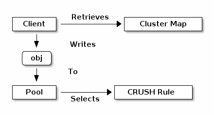

# Ceph concept

## I. Table of contents

- [Ceph concept](#ceph-concept)
  - [I. Table of contents](#i-table-of-contents)
  - [II. The Ceph architecture](#ii-the-ceph-architecture)
    - [1. Storing Data](#1-storing-data)
  - [III. The core Ceph components](#iii-the-core-ceph-components)
    - [1. Scalability and high availability](#1-scalability-and-high-availability)
      - [a) CRUSH introduction](#a-crush-introduction)
      - [b) Cluster map](#b-cluster-map)
      - [c) High availability monitors](#c-high-availability-monitors)
      - [d) Smart daemons enable hyperscale](#d-smart-daemons-enable-hyperscale)
    - [2. Ceph pools](#2-ceph-pools)
    - [3. Ceph placement groups](#3-ceph-placement-groups)
    - [4. Ceph CRUSH ruleset](#4-ceph-crush-ruleset)
    - [5. Ceph input/output operations](#5-ceph-inputoutput-operations)
    - [6. Ceph replication](#6-ceph-replication)
      - [a) Data copies](#a-data-copies)
    - [7. Ceph erasure coding](#7-ceph-erasure-coding)
      - [a) Reading and writing encoded chunks](#a-reading-and-writing-encoded-chunks)
      - [b) Interrupted full writes and Interrupted append](#b-interrupted-full-writes-and-interrupted-append)
    - [8. Ceph `ObjectStore`](#8-ceph-objectstore)
    - [9. FileStore](#9-filestore)
    - [10. BlueStore](#10-bluestore)
    - [11. Ceph self management operations](#11-ceph-self-management-operations)
    - [12. Ceph heartbeat](#12-ceph-heartbeat)
    - [13. Ceph rebalancing and recovery](#13-ceph-rebalancing-and-recovery)
    - [14. Ceph data integrity](#14-ceph-data-integrity)
    - [15. Ceph peering](#15-ceph-peering)
  - [IV. References](#iv-references)

## II. The Ceph architecture

Ceph - 1 hệ lưu trữ phân tán object (distributed data object store) được thiết kế để cung cấp hiệu suất, độ tin cậy và khả năng mở rộng. Ceph có độ tin cậy cao, dễ dàng quản lý, mã nguồn mở và miễn phí. Ceph mang lại khả năng mở rộng đáng kinh ngạc - từ hàng petabyte đến exabyte dữ liệu hay hàng nghìn clients truy cập. Ceph Storage Cluster chứa 1 số lượng lớn các node, các node này tận dụng 1 cách thông minh phần cứng và daemon. Chúng cũng sẽ giao tiếp với nhau để nhân bản và phân phối dữ liệu liên tục.

Ceph cung cấp cụm lưu trữ Ceph (Ceph Storage Cluster) có khả năng mở rộng vô hạn dựa trên RADOS (Reliable Autonomic Distributed Object Store) - A Scalable, Reliable Storage Service for Petabyte-scale Storage Clusters. Ceph Storage Cluster bao gồm các loại daemon sau:

- Ceph Monitor - `ceph-mon`: Ceph Monitor duy trì 1 bản gốc của Ceph Storage cluster map so với trạng thái hiện tại của Ceph Storage cluster. 1 cụm Ceph monitor (A cluster of Ceph monitors) luôn sẵn sàng nếu có 1 monitor deamon bị fail. Clients có thể truy xuất 1 bản sao của cluster map từ Ceph monitor. Vì monitors yêu cầu tính nhất quán cao nên Ceph sử dụng Paxos (blockchain) để đảm bảo thống nhất về trạng thái của Ceph Storage cluster.
- Ceph OSD Daemon - `ceph-osd`: Ceph OSDs lưu trữ dữ liệu cho Ceph clients. Ceph OSD Daemon cũng sử dụng CPU, memory và mạng của Ceph nodes để sao chép dữ liệu, erasure coding, tái cân bằng (rebalancing), khôi phục, giám sát và báo cáo cho monitor.
- Ceph Manager - `ceph-mgr`: Ceph Manager duy trì thông tin chi tiết về các placement groups, process metadata và host metadata thay cho Ceph Monitors. Điều này giúp cải thiện đáng kể hiệu suất ở trên quy mô lớn. Ceph manager cũng thực thi nhiều lệnh read-only Ceph CLI như thống kê các placement groups. Ceph manager cũng cung cấp các RESTful API giám sát.
- Ceph Metadata Server - `ceph-mds` quản lý file metadata khi CephFS được sử dụng để cung cấp file services.

Storage cluster clients và mỗi Ceph OSD Daemon sử dụng thuật toán CRUSH để tính toán tối ưu về vị trí dữ liệu thay vì phụ thuộc vào bảng tra cứu trung tâm (central lookup table). Native interface của Ceph Storage Cluster (Ceph storage cluster protocol) cũng như 1 interface của 1 số dịch vụ được sử dụng thông qua `librados` (VD như Ceph clients).

### 1. Storing Data

Clients cần 1 số thông tin sau để giao tiếp với Ceph Storage Cluster:

- Ceph configuration file hoặc cluster name và địa chỉ của monitor.
- The pool name.
- The username and path to secret key.

Ceph clients duy trì các object IDs và pools name (nơi lưu trữ đối tượng). Lưu ý rằng Ceph clients không cần duy trì index đối tượng với OSD hay bất cứ công cụ nào để tra cứu ra vị trí đối tượng 1 cách trực tiếp. Để truy xuất dữ liệu, Ceph clients sẽ truy cập vào Ceph monitors để lấy bản sao mới nhất của Ceph Storage cluster map. Sau đó, Ceph clients sẽ ném object name và pool name cho `librados`, nó sẽ tính toán placement group và primary OSD của object bằng cách sử dụng thuật toán CRUSH. Clients ngay lập tức sẽ kết nối tới primary OSD, nơi mà nó có thể thực hiện các thao tác đọc và ghi. Lúc này sẽ không có máy chủ trung gian giữa Client và OSD.

Khi OSD lưu trữ dữ liệu, nó nhận dữ liệu (được lưu trữ dưới dạng các đối tượng RADOS) từ  Ceph Clients – cho dù Client là Ceph Block Device, Ceph Object Storage,  Ceph File System hoặc triển khai tùy chỉnh mà ta tạo bằng cách sử dụng `librados` . Mỗi 1 đối tượng được lưu trữ trong 1 Object Storage Device (OSD). Ceph OSD Daemon xử lý các hoạt động đọc, ghi và sao chép trên ổ lưu trữ. Với Filestore back end cũ, mỗi đối tượng RADOS được lưu trữ dưới dạng tệp riêng biệt trên 1 filesystem đã được config (thường là XFS fileystem). Nhưng trên BlueStore back end **mặc định** mới, các đối tượng được lưu trữ theo kiểu cơ sở dữ liệu nguyên khối (a monolithic database-like fashion).

**Note**: ID của object là duy nhất trên toàn bộ cluster, không chỉ trên mỗi OSD.

Ceph OSDs lưu trữ tất cả object dưới dạng flat namespaces và không có phân cấp thư mục. Mỗi đối tượng có 1 **ID định danh duy nhất trên toàn cụm**, binary data và meta data (gồm 1 tập hợp các cặp name/values)

Semantics của dữ liệu (định dạng của dữ liệu) sẽ tùy thuộc vào Ceph clients xác định. Ví dụ: CephFS sử dụng metadata để lưu trữ các thuộc tính file như chủ sở hữu file, ngày tạo, ngày sửa đổi lần cuối, v.v.

**Note**:  Các oject bao gồm: ID duy nhất, binay data, metadata hoàn toàn có thể đại diện cho các loại dữ liệu khác như có cấu trúc, phi cấu trúc cũng như legacy and leading edge data storage interfaces.

## III. The core Ceph components

### 1. Scalability and high availability

Trong kiến trúc truyền thống, cliets sẽ giao tiếp với một thành phần tập trung (ví dụ:  gateway, broker, API, facade, etc.). Điều này gây giới hạn hiệu suất và khả năng mở rộng của hệ thống, đồng thời cũng dẫn đến một điểm lỗi duy nhất (a single point of failure), nghĩa là nếu thành phần tập trung gặp vấn đề thì toàn bộ cả hệ thống cũng sẽ gặp vẫn đề).

Ceph loại bỏ sự tập trung bằng cách sử dụng 1 thuật toán được gọi là CRUSH. Ngoài ra, cho phép clients tương tác trực tiếp với OSD Daemons. Ceph OSD cũng tạo các replicas trên các Ceph nodes khác để đảm bảo tính toàn vẹn dữ liệu và tính sẵn sàng cao. Ceph cũng sử dụng một cluster monitors để đảm bảo tính khả dụng cao.

#### a) CRUSH introduction

Ceph Clients và Ceph OSD Daemons đều sử dụng thuật toán CRUSH để tính toán tối ưu thông tin về vị trí đối tượng, thay vì phải phụ thuộc vào bảng tra cứu trung tâm (central lookup table). CRUSH cung cấp cơ chế quản lý dữ liệu tốt hơn so với các phương pháp tiếp cận cũ và cho phép mở rộng quy mô lớn bằng cách phân phối đồng đều công việc cho tất cả các clients và OSD daemon trong cluster. CRUSH sử dụng các nhân bản dữ liệu (data replication) 1 cách thông minh để đảm bảo khả năng phục hồi, phù hợp với việc lưu trữ quy mô lớn.

#### b) Cluster map

Ceph OSD và Ceph Clients sẽ có các thông tin về cluster topology. Cluster topology được gọi chung là cluster map và bao gồm các 5 maps sau:

- The Monitor Map: Chứa `fsid` (cluster ID), vị trí (position), địa chỉ và cổng (port) của mỗi monitor. Nó cũng cho biết map epoch (phiên bản map tại 1 thời điểm) hiện tại, thời điểm map được tạo, và lần cuối thay đổi. Để xem monitor map, ta có thể sử dụng câu lệnh `ceph mon dump`.
- The OSD Map: Chứa `fsid`, danh sách pools, số lượng nhân bản (replica sizes), PG numbers, a list of OSDs and their status (e.g., `up`, `in`), thời gian map được tạo và lần cuối thay đổi. Để xem OSD map, ta có thể sử dụng câu lệnh `ceph osd dump`.
- The PG Map: Chứa PG version, the last OSD map epoch, the full ratios, and details on each placement group such as the PG ID, the *Up Set*, the *Acting Set*, trạng thái của PG (e.g., `active + clean`), và thống kê dữ liệu sử dụng cho từ pool (data usage statistics for each pool).
- The CRUSH Map: Chứa danh sách các thiết bị lưu trữ (storage devices), the failure domain hierarchy (e.g., device, host, rack, row, room, etc.) và rules khi lưu trữ dữ liệu. Để xem CRUSH map, ta dùng câu lệnh `ceph osd getcrushmap -o {comp-crushmap-filename}`, và sau đó để `decompile` map ta chạy `crushtool -d {comp-crushmap-filename} -o {decomp-crushmap-filename}`. Lúc này ta có thể xem map ở trong file `{decomp-crushmap-filename}` bằng cách sử dụng trình soạn thảo hoặc lệnh `cat`.
- The MDS Map: Chứa MDS map epoch hiện tại, thời điểm map được tạo và lần cuối thay đổi. Nó cũng có pool để lưu trữ metadata, a list of metadata servers, and which metadata servers are `up` and `in`. Để xem OSD map, ta có thể sử dụng câu lệnh `ceph fs dump`.

Ceph Monitors duy trì một bản gốc của cluster map bao gồm các thành phần trong cluster, trạng thái, các thay đổi và tình trạng chung của Ceph Storage Cluster.

#### c) High availability monitors

Trước khi Ceph clients có thể đọc hoặc ghi dữ liệu, nó buộc phải `contact` với Ceph Monitor để có được bản sao mới nhất của cluster map. Ceph Storage Cluster hoàn toàn có thể hoạt động với 1 monitor duy nhất, tuy nhiên điều này lại dẫn đến a single point of failure (nếu monitors `down` thì Ceph clients không thể đọc hoặc ghi dữ liệu).

Để tăng độ tin cậy và khả năng chịu lỗi Ceph cung cấp 1 cluster of monitor. Trong cluster of monitors, độ trễ (latency) và các lỗi khác có thể khiến monitors bị tụt lại ở phía sau so với trạng thái của cluster. Vì vậy, Ceph phải có sự thống nhất giữa cac monitors. Để làm được điều này Ceph sử dụng biến thể thuật toán Paxos (blockchain). Thuật toán này yêu cầu phần lớn các monitor cần trong trạng thái active, dựa trên `Majority rule` của Paxos là nếu xử lý `m` monitor bị fail ta cần `2m+1` monitor. Ví dụ nếu cluster có 2 monitor thì sẽ không xử lý được khi 1 trong monitor bị fail nhưng nếu là 3 monitors thì sẽ xử lý được 1 monitor khi nó fail, 4 monitor xử lý được 1 và 5 monitor xử lý được 2. Vì vậy tổng số lượng monitor nên là số lẻ để tối ưu. Số lượng monitors tối thiểu trong production nên là 3 và hiếm khi lên 7 monitor hoặc nhiều hơn. Ngoài ra, Ceph Monitors nodes cần NTP để đồng bộ thời gian với nhau.

#### d) Smart daemons enable hyperscale

Trong nhiều kiến trúc cluster, các node trong cluster sẽ giao tiếp với thành phần tập trung để biết được rằng node đó có thể truy cập và thành phần tập trung sẽ giao tiếp với clients. Đây là 1 nút thắt cổ chai lớn khi cần phải scale cluster.

Ceph giúp loại bỏ nút thắt này bằng cách cho OSDs Daemons của Ceph và Ceph Clients `nhận biết nhau` (cluster aware). Hiểu đơn giản là giống như Ceph Clients, mỗi OSD daemon sẽ có thể biết và giao tiếp được với các OSD daemon khác trong cùng cụm. Điều này cũng cho phép OSD Daemons tương tác trực tiếp với các OSD Daemons và Ceph Monitors (Giống Ceph Clients). Ngoài ra, Ceph Clients cũng sẽ tương tác trực tiếp được với OSD Daemons.

Việc Ceph Clients giao tiếp trực tiếp như vậy đã làm cho OSD Daemons có thể tận dụng CPU và RAM của Ceph nodes để xử lý tác vụ của thành phần tập trung. Hay nói cách khác OSD Daemons lúc này sẽ xử lý các tác vụ của thành phần tập trung. Điều này mang lại 1 số lợi ích sau: **Phần này có thể gây lặp ở dưới nên đã được comment lại.**

<!--
1. OSDs Service Clients Directly - OSDs xử lý request Clients trực tiếp: Vì bất kỳ thành phần mạng nào đều có giới hạn truy cập đồng thời nên 1 hệ thống tập trung luôn bị giới hạn về mặt vật lý khi scales to. Bằng việc cho Ceph Clients giao tiếp trực tiếp với Ceph OSD Daemons, Ceph giúp tăng hiệu suất của cả hệ thống khi loại bỏ `a single point of failure`. Ceph Clients cũng có thể duy trì 1 session với OSD Daemons khi cần tahy vì với một thành phần tập trung.
2. OSD Membership and Status - Trạng thái và các OSD: Các Ceph OSD Daemon sẽ cùng nhau tạo thành 1 cluster riêng để báo cáo về status của chúng. Ceph OSD Daemons sẽ có 2 status cơ bản `up` hoặc `down` ánh xạ việc nó **có lỗi hay không**. Nếu một Ceph OSD Daemons bị `down` trong `Ceph Storage Cluster` thì status đang được Ceph Demons báo cáo rằng nó bị lỗi và không thể xử lý các requests của Ceph Client. Tuy nhiên, nếu OSD Daemons không chạy (ví dụ như bị crash), thì Ceph OSD Daemons không thể thông báo với Ceph Monitor rằng nó đang `down`. OSDs sẽ định kỳ gửi messages cho Ceph Monitor (`MPGStats` messages đối với version trước luminous và `MOSDBeacon` messages trong version luminous). Nếu Ceph Monitor không thấy messages sau một khoảng thời gian nhất định (có thể config) thì nó sẽ đánh dấu OSD đó `down`. Cơ chế này khá an toàn. Tuy nhiên, thông thường Ceph OSDs Daemon sẽ xác định xem nếu OSDs lân cận bị `down` thì sẽ báo lại với Ceph Monitor(s). Điều này sẽ giảm 1 phần gánh nặng cho Ceph Monitor.
3. Data Scrubbing - Dọn dẹp dữ liệu: Để duy trì tính nhất quán và sự "sạch sẽ" cho dữ liệu, Ceph OSD Daemons có thể dọn dẹp object (scrub object). Bằng cách so sánh objects metadata hiện tại ở trên OSD của chính mình và so sánh với các replicas được lưu trữ ở các OSD khác. Việc Scrubbing xảy ra trên ừng Placement Group (Không phải trên từng object). Scrubbing (thường thực hiện hàng ngày) sẽ phát hiện những vấn đề của metadata như kích thước v.v. Ceph OSDs cũng thực hiện `Deep scrubbing` bằng cách so sánh dữ liệu trong object `bit for bit` với `checksums` của nó. Deep scrubbing (thường thực hiện hàng tuần) sẽ phát hiện các bad sectors trên drive, điều mà không phát hiện ra được khi ta chỉ dùng `light scrub`.
4. Replication - Bản sao: Giống như Ceph Clients, Ceph OSDs Daemon cũng sử dụng thuật toán CRUSH nhưng Ceph OSDs Daemon sử dụng để tính toán vị trí các replicas của object nên được lưu trữ ở đâu và cho việc tái cân bằng (rebalancing). Theo quy trình thông thường, client sẽ sử dụng thuật toán CRUSH để tính ra được vị trí object nên được lưu trữ, ánh xạ object tới pool và placement group sau đó dựa vào CRUSH map sẽ xác định primary OSD cho placement group.
Client sẽ `write` object vào primary OSD của placement group đã xác định. Sau đó primary OSD cùng với bản copy của CRUSH map sẽ xác định secondary và tertiary OSDs (số lượng tuỳ thuộc config) của placement group đó để lưu trữ các replicas của object. Khi hoàn thành việc lưu trữ các replicas, primary OSD sẽ phản hồi lại với Client. Với khả năng tự sao chép dữ liệu, Ceph OSD Daemons sẽ giảm gánh nặng cho Ceph Client khỏi các công việc đó, trong khi đồng thời cũng đảm bảo tính khả dụng và toàn vẹn dữ liệu cao.

 -->

### 2. Ceph pools

Ceph storage systems cung cấp cho ta 1 khái niệm `Pool`, là 1 phân vùng logic để lưu trữ các object. Các Ceph administrators có thể tạo các pool cho từng loại dữ liệu cụ thể; ví dụ như chia ra các pool theo từng mục đích khác nhau.

Ceph pools sẽ xác định các parameters sau:

- Pool Type: Để đảm bảo tính bền vững của dữ liệu Ceph có thể sử dụng 1 trong 2 phương thức: duy trì các replicas của object hoặc `erasure coding`. Các phương thức này được sử dụng trên pool đã được config (2 pool khác nhau có thể dùng 2 phương thức khác nhau) và không thể thay đổi khi đã tạo pool. Pool type sẽ xác định phương thức ta sử dụng. Pool type hoàn toàn `transparent` với Ceph Client. (Hiểu đơn giản là Client không cần care).
- Placement Groups: Trong các storage cluster quy mô lớn, Ceph pool có thể phải lưu trữ hàng triệu objects hoặc nhiều hơn. Ceph sẽ phải xử lý rất nhiều hoạt động như đảm bảo tính bền vững dữ liệu (bằng 1 trong 2 phương thức: replicas hoặc erasure code chunks tuỳ thuộc Pool Type), tính toàn vẹn dữ liệu (bằng các phương thức scrubbing, CRC checks, replication, rebalancing và recovery). Do đó, việc quản lý dữ liệu trên từng đối tượng có thể giảm khả năng mở rộng và gây ra tình trạng nghẽn cổ chai. Ceph giải quyết vấn đề bằng cách **chia pool vào các placement groups**. Thuật toán CRUSH sẽ tính toán placement groups cho việc lưu trữ dữ liệu và cũng tính Acting Set của OSDs cho placement group. **CRUSH sẽ đặt mỗi object vào 1 placement group. Sau đó CRUSH lưu trữ mỗi placement group trong 1 tập hợp OSDs**.
- CRUSH Ruleset: CRUSH cũng đóng 1 vai trò quan trọng khác: CRUSH có thể xác định failure domains và performance domains bằng cách định nghĩa, tổ chức OSDs theo thứ bậc thành osds, nodes, rack hoặc row v.v (failure domains). Để xác định được failure domains và performance domains, Administrators chỉ cần config CRUSH ruleset khi tạo pool và tất nhiên, cũng không thể thay đổi được sau khi pool đã tạo. **Xem rõ thêm ở CRUSH Ruleset phần dưới**.
- Durability: Trong các storage cluster quy mô lớn, hardware failure là 1 điều bình thường, không phải là `exception`. Vì ta chia dữ liệu thành các object để lưu trữ nên khi mất 1 hoặc nhiều object thì nó sẽ gây ảnh hướng tới dữ liệu khi được hợp lại và khiến nó lỗi, ảnh hưởng khá nghiêm trọng. Do đó, để đảm bào tính bền vững của dữ liệu Ceph cung cấp cho ta 2 phương thức:
  - Replica pools (Pool có type là replica) sử dụng CRUSH failure domains để lưu trữ các replicas của object sang các tổ chức thứ bậc vật lý khác (ví dụ các osds khác, nodes khác, rack khác v.v). Điều này sẽ đảm bảo nếu hardware failure xảy ra.
  
  - Erasure coded pools (Pool có type là erasure coding) lưu trữ mỗi object dưới dạng `K+M` chunks (miếng). Trong đó, `K` thể hiện số lượng data chunk còn `M` là số lượng coding chunks. Ngoài ra, tổng của chúng cũng thể hiện tổng số lượng OSDs dùng để lưu trữ object, `M` cũng cho biết số lượng OSDs tối đa có thể lỗi mà vẫn khôi phục lại được object.
Từ góc nhìn của Ceph Clients, storage cluster trông khá là đơn giản. Nó chỉ cần lấy bản sao Cluster Map từ Ceph Monitor, sau đó ghi và đọc object vào pools. Tuy nhiên từ những điều trên, Pools đóng vai trò quan trọng trong việc cách Ceph storage cluster phân phối và lưu trữ dữ liệu. Những hoạt động phức tạp này thì Clients đơn giản không cần care =)).

### 3. Ceph placement groups

Ceph sử dụng các placement groups (PGS) để thực hiện quản lý một số lượng lớn các đối tượng hiệu quả hơn. **Mỗi pool sẽ được chia thành 1 tập hợp placement groups**. Sau đó, thuật toán CRUSH lấy cluster map và `status of the cluster` để phân phối đều PGs và `giả ngẫu nhiên` (pseudo-randomly) cho các OSDs trong cluster.

Khi administrator tạo 1 pool, CRUSH sẽ tạo ra các PGs cho pool đó (số lượng do user defined). Số lượng PGs nên hợp lý với số lượng của OSDs. Ví dụ, ta có 1 pool và trong đó chỉ có 1 OSDs, nếu ta chia thành 100PGs thì nghĩa là mỗi PGs chữa khoảng xấp xỉ 1% dữ liệu của toàn bộ pool đó. Số lượng của PGs sẽ ảnh hưởng tới hiệu suất của CEPH khi cần di chuyển PG từ OSD này sang OSD khác. Nếu pool có quá ít PGs, Ceph sẽ phải di chuyển 1 lượng dữ liệu lớn mỗi lần di chuyển 1 PG → ảnh hưởng đến network → giảm hiệu suất của cluster. Nếu pool quá nhiều PGs, Ceph sẽ phải sử dụng nhiều CPU và RAM chỉ để di chuyển 1 lượng nhỏ dữ liệu → ít hiệu quả hơn → giảm hiệu suất của cluster.

Ta nhắc lại, Ceph sẽ đảm bảo sự mất mát dữ liệu bằng lưu trữ các replicas của object hoặc erasure code chunks của object. Do đó, **danh sách** tập hợp các OSDs của PGs để lưu trữ từng replicas hoặc từng erasure code chunks gọi là `Acting Set`. Administrator ngoài việc xác định được số lượng PGs trong 1 pool thì cũng có thể chỉ rõ số lượng replicas hoặc số lượng erasure code chunks. Còn việc cho OSDs ở trong Acting Set của PGs nào sẽ do thuật toán CRUSH xử lý.

Sự kết hợp giữa thuật toán CRUSH và PGs mang lại khả năng linh hoạt cho Ceph. Chỉ cần có thay đổi trong cluster map hay cluster state có thể làm cho Ceph di chuyển PGs từ OSD này sang OSD khác 1 cách tự động. Ta sẽ thấy rõ hơn ở 1 vài ví dụ dưới đây:

- Expanding the Cluster - Mở rộng cluster: Khi thêm 1 host mới và các OSDs của nó vào cluster thì sẽ làm cho cluster map thay đổi. Vì CRUSH phân phối đều PGs và `giả ngẫu nhiên` PGs vào OSD, nên khi thêm thì CRUSH sẽ gán lại 1 vài PGs vào OSD mới. Administrators sẽ không cần cân bằng cluster 1 cách thủ công. Ngoài ra, CRUSH cũng sẽ cho các OSDs mới cũng chứa xấp xỉ 1 lượng dữ liệu giống như các OSDs khác. Điều này ngăn việc OSDs mới trống quá nhiều → dễ trở thành `điểm nóng` khi ghi trong cluster.
- An OSD Fails: Khi 1 OSD fail sẽ làm cho `state of the cluster` bị thay đổi. Ceph sẽ tạm thời mất 1 bản replicas hoặc 1 erasure code chunks và cần phải tạo 1 bản. Nếu primary OSD trong `Acting set` bị fail thì OSD tiếp theo trong `Acting set` trở thành primary và CRUSH sẽ tính toán ra OSD mới để lưu trữ bổ sung 1 bản replicas hoặc 1 erasure code chunks.

Bằng cách quản lý hàng triệu đối tượng thông qua hàng trăm cho tới hàng nghìn PGs, Ceph storage cluster có thể dễ dàng mở rộng, thu nhỏ hoặc phục hồi lại khi bị lỗi 1 cách hiệu quả.

Đối với Ceph Clients, sử dụng thuật toán CRUSH thông qua `librados` API khiến việc đọc ghi object rất đơn giản. Nó chỉ cần đọc hoặc ghi 1 object từ pool. Primary OSD trong acting set có thể ghi replicas hay erasure code chunks của object đó thay cho Ceph client vào secondary OSD. Như đã nói ở trên, cluster map hay cluster state thay đổi thì CRUSH sẽ tính toán để những OSDs của PG cũng thay đổi theo. Ví dụ, khi Client ghi object `fool` vào pool `bar`. CRUSH sẽ gán object vào PG `1.a` → lưu nó trong OSD `5` và các bản sao ở OSD `10`, `15` tương ứng. Nếu OSD `5` fail, cluster state thay đổi. Khi Client yêu cầu đọc object `fool` từ pool `bar`, `librados` sẽ tự động đọc dữ liệu từ OSD `10` như primary OSD mới.

Ceph Client thông qua `librados`, kết nối trực tiếp với primary OSD ở trong acting set để đọc ghi đối tượng. Vì các hoạt động I/O phi tập trung, nên network oversubscription không phải là vấn đề với Ceph.

Sơ đồ dưới mô tả cách **CRUSH gán các object vào PGS và gán PGs sang OSDs**. Thuật toán CRUSH gán PGs cho OSDs sao cho mỗi OSD trong acting set nằm trong một failure domain riêng biệt, thường có nghĩa là OSDS sẽ luôn ở trên host riêng biệt và đôi khi trong các racks riêng biệt.

### 4. Ceph CRUSH ruleset

Ceph chỉ định CRUSH ruleset (tập hợp rule) cho pool. CRUSH rules sẽ cho biết cách Ceph clients chọn buckets và primary OSD (ở bên trong buckets) để lưu trữ object. Ngoài ra, nó cũng cho biết cách primary OSD chọn buckets và secondary OSDs để lưu trữ replicas hoặc coding chunks. Ví dụ, ta có thể tạo ra rule chọn 1 cặp OSDs (backed by SSDs) cho 2 object replicas hay rule chọn ra 3 OSDs (back by SAS drives) trong 1 data centers khác để lưu 3 replicas.

**Note giải thích**:

Để map placement groups cho OSDs, CRUSH map tạo ra 1 phân cấp list of bucket types mà ta có thể nhìn thấy khi generate ra CRUSH map. Việc tạo ra bucket hierarchy để tách biệt leaf nodes theo failure domains hoặc performance domains hoặc cả 2. Failure domains (dịch tạm là miền lỗi) bao gồm các đơn vị phân cấp hosts, chassis, racks, power , pods, rows, rooms, và data centers (Có thể nhìn thấy ở CRUSH map dưới phần `type`, thực chất đây là implements của Failure domains). Performance domains (dịch tạm là miền hiệu suất) bao gồm failure domains và các OSDs của 1 cấu hình cụ thể (như các ổ SSDs, SATA drives). Những devices sẽ có 1 giá trị `class` trong CRUSH map (thực chất `class` là implements của performance domains), sẽ cho ta biết deivce đó là gì như HDD, SSD, NVME để có thể nhanh chóng xây dựng CRUSH hierarchies. Các Administrators có thể dựa vào Performance domains để deploy storage pools 1 cách thích hợp. Ví dụ như các devices toàn SSD sẽ có 1 pool riêng so với 1 pool devices toàn HDD, điều này sẽ tối ưu hiệu suất hơn so với việc cho hết lại thành 1 pool.

Trong hình ví dụ dưới đây, ta thấy bucket hierarchy có 4 leaf buckets (osd 1-4), 2 node buckets (host 1-2) và 1 rack node (rack 1). Rach node này không được coi là `root default`.

Ngoài trừ leaf nodes đại diện cho các OSD, phần còn lại của `hierarchy` là tuỳ ý. Ngoài ra Administrators có thể tạo 1 giá trị riêng (ngoài các `type`), nếu giá trị hiện tại không phù hợp.

Trong CRUSH map các node bucket trong phần `hierarchy` có các giá trị cần chú ý sau:

- `id` là 1 số nguyên âm duy nhất.
- `alg` là thuật toán của buckets mặc định là `straw`.
- `hash` giá trị mặc định là `0` reference tới thuật toán `reference`.

Ngoài ra, trên tất cả các node (bao gồm leaf node và bucket) giá trị `weight` thể hiện tổng dữ liệu mà devices hoặc hierarchy subtree có thể chứa. Weight được tính từ leaves (là size of deivces), sau đó tính tổng cộng dồn lên. Do đó weight của `root` node sẽ là tổng của tất cả devices (leaf node) mà nó có. Thông thường weights được tính theo đơn vị terabytes (TB).

Ngoài ra, ta có thể dễ dàng xem CRUSH hierarchy của cluster (bao gồm cả weights) bằng câu lệnh: `ceph osd tree`.

### 5. Ceph input/output operations

Ceph clients nhận `Cluster map` từ Ceph monitor, sau đó bind to a pool, và làm các hoạt động input/ouput (I/O) trên objects ở bên trong placement groups. CRUSH ruleset của pool và số lượng của placement groups là các yếu tố chính cách Ceph đặt dữ liệu. Với `the latest version of the cluster map`, client sẽ biết tất cả về monitors, OSDs trong cluster và trạng thái của chúng. **Tuy nhiên, cliets sẽ không biết gì về vị trí của object**.

Để biết được ví trí của object, client chỉ cần object ID và pool name. Việc còn lại để ra được vị trí sẽ bằng cách tính toán.

Ví dụ, Ceph 1 pool có tên `liverpool`. Khi client muốn lưu 1 object có id `john` thì nó sẽ làm các bước sau đây để tìm ra được ví trí:

1. Clients nhập tên pool là `liverpool`, và object id là `john` cho Ceph.
2. CRUSH nhận object id và băm (hash) nó
3. CRUSH tính toán hash modulo của số lượng PG để lấy PG ID (ví dụ là `58`)
4. CRUSH tính toán primary OSD tương ứng với PG ID.
5. Ceph lấy được ID của pool dựa trên tên pool (ví dụ `liverpool` = `4`)
6. Ceph ghép pool ID vào PG ID (sẽ là `4.58`)
7. Client sẽ làm các hoạt động I/O với object như CRUD bằng cách kết nối trực tiếp với Primary OSD trong Acting Set.

Việc cho Ceph client thông qua `librados` tính toán vị trí đối tượng sẽ nhanh hơn nhiều so với việc client query tới storage cluster mỗi lần I/O. Thuật toán CRUSH cho phép client tính toán vị trí đối tượng **nên được lưu** ở đâu, cho phép client kết nối trực tiếp Primay OSD trong Acting Set để lưu trữ và nhận object. Nếu cluster state changed, client có thể dễ dàng request update cluster map từ ceph monitor.

### 6. Ceph replication

Giống như Ceph client, Ceph OSDs có thể kết nối tới Ceph monitor để lấy bản copy mới nhất của cluster map. Ceph OSDs cũng sử dụng thuật toán CRUSH nhưng chỉ dùng để tính toán nơi lưu trữ replicas của objects. Như đã nói ở trên, Ceph clients dùng CRUSH để tính ra PG ID và tìm primary OSD trong Acting Set để I/O object.

Khi client ghi object vào primary OSD, primary OSD sẽ tìm số lượng replicas mà nó cần xử lý lưu trữ (tìm ở giá trị của `osd_pool_default_size`). Primary OSD sẽ ghi object vào secondary OSDs (đã tính toàn bằng CRUSH trong Acting set).

Khi primary OSD nhận được xác nhận (acknowledgment) ghi thành công từ secondary OSDs thì nó sẽ tự động acknowledgment ghi thành công cho Ceph Client.

Với khả năng tự sao chép dữ liệu, Ceph OSD Daemons sẽ giảm gánh nặng cho Ceph Client khỏi các công việc đó, trong khi đồng thời cũng đảm bảo tính khả dụng và toàn vẹn dữ liệu cao.

**Note:** Primary OSDs và secondary OSDs thông thường nằm trong failure domains riêng biệt. CRUSH sẽ tính toán IDs của secondary OSDs sao cho phù hợp với failure domains.

#### a) Data copies

Trong replicated storage pool, Ceph cần nhiều bản copy của object để I/O khi đang ở trong `degraded state`. Client vẫn có thể đọc và ghi dữ liệu cho dù 1 trong các OSDs ở Acting Set bị fail. Do đó, Ceph mặc định tạo ra 3 bản replica của đối tượng (`osd_pool_default_size` có deafault là `3`) và trong đó mặc định có tối thiểu 2 bản replicas cho việc ghi ở trong pool (`osd_pool_default_min_size` có deafult là `0`, The default value is `0` which means no particular minimum. If `0`, minimum is `size - (size / 2)`). Khi pool đang ở `degraded` mode, giá trị `osd_pool_default_min_size` sẽ đảm bảo số lượng replicas tối thiểu trong pool cho việc `acknowledge an I/O operation` cho client. Nếu giá trị không được đặt, Ceph sẽ không `acknowledge` cho Client → **có thể gây mất dữ liệu**.

Trong erasure-coded pool, Ceph cần lưu trữ chunks of an object trên nhiều OSDs để vẫn có thể hoạt động bình thường nếu `degraded state` xảy ra.

**Note:** Red Hat supports the following `jerasure` coding values for `k`, and `m`:

k=8 m=3

k=8 m=4

k=4 m=2

### 7. Ceph erasure coding

Erasure code là 1 mã sửa lỗi chuyển tiếp (forward error correction - FEC). Hiểu đơn giản FEC sẽ chia message có `K` chunks thành 1 message dài hơn có `N` chunks sao cho Ceph có thể khôi phục lại message ban đầu từ nếu như `N` chunks mất đi 1 số lượng chunks. Ceph cung cấp khá nhiều thuật toán erasure code và triển khai nó dựa plug-in architecture. Thuật toán phổ biến và sử dụng nhiều nhất là `Reed-Solomon` cũng là thuật toán plugin mặc định của Ceph `jerasure` sử dụng. Ngoài ra còn có các plugin khác:

- `jerasure`: Mặc định của Ceph cho erasure coded pools. Nó Thông dụng, linh hoạt và đóng gói thư viện `Jerasure` để triển khai. Thư viện này sử dụng thuật toán Reed-Solomon, Cauchy backends.
- `isa` (intel only): Nó đóng gói thư viện `ISA-L` của intel (Intel Storage Acceleration Library). Thư viện sử dụng SIMD để tăng tốc Erasure Coding backends.
- `lrc`: Viết tắt của `Locally repairable erasure code`. Giúp đọc ít OSDs hơn khi khôi phục lại message.
- `SHEC`: Đóng gói thư viện `multiple SHEC`. Nó cho phép khôi phục dữ liệu hiệu quả hơn Reed Solomon.
- `CLAY`: Viết tắt của `coupled-layer`. Nó được thiết kế để tiết kiệm băng thông mạng và I/O khi một node, OSD hoặc rack bị lỗi đang được sửa chữa.

Dưới đây ta sẽ nói kỹ về plugin `jerasure` và sơ qua 1 chút về plugin `lrc`.

Erasure coded pool (sử dụng `jerasure`) sẽ chia mỗi object dựa trên công thức `N=K+M` chunks, trong đó `K` chunks là các khối dữ liệu ban đầu - data chunks. Giá trị `M` đại diện cho các chunks dự phòng mà thuật toán erasure code bổ sung để khôi phục dữ liệu nếu có lỗi - coding chunks. Giá trị `N` là tổng số chunks sau quá trình erasure coding. **Ta hoàn toàn có thể khôi phục lại object ban đầu khi mất bất kỳ chunks nào và tối đa `N-K` chunks (Thực thế khi Ceph nhận load ngay được `K` chunks bất kỳ khôi phục ngay lập tức)**. Ví dụ `K` = 10, `N` = 16 thì `M` = 6 là số lượng coding chunks sẽ được thêm vào để lưu trữ cùng `K` chunks. Ta sẽ chia 16 chunks này cho 16 OSDs trong failure domains riêng biệt. Ta hoàn toàn có thể khôi phục lại dữ liệu chỉ từ 10 chunks bất kỳ cho dù đã mất tận 6 chunks. Do đó, Ceph sẽ không làm mất dữ liệu và đảm bảo độ chịu lỗi cao.

Cũng giống như replicated pools, trong erasure-coded pool thì primary OSDs cũng nhận tất cả các hoạt động ghi. Như đã nói ở trên, primary OSDs trong replicated pools sẽ copy các replicas sang các secondary OSDs. Đối với erasure-coded pool, thì sẽ khác biệt 1 chút. Vì nó lưu trữ các object thành `K+M` chunks, nên pool phải được cấu hình có size `K+M` để lưu mỗi chunks trong các OSDs ở Acting Set. Primary OSDs sẽ chịu trách nhiệm chia object thành `K+M` chunks và gửi các chunks cho các OSDs khác. "*The primary OSD is also responsible for maintaining an authoritative version of the placement group logs.*"

#### a) Reading and writing encoded chunks

Ví dụ ta config pool  `K`=5, `M`=2. Khi Ceph cần ghi 1 object có name là `NYAN` và dữ liệu của nó là `ABCDEFGHI` vào pool, thuật toán erasure encoding sẽ chia dữ liệu ra thành 4 chunks lần lượt là: `ABC`, `DEF` và `GHI`. Thuật toán sẽ `pad` thêm cho dữ liệu nếu không chia hết cho `K`. Nó cũng tạo ra thêm 2 coding chunks là: `YXY` và `QGC`. Mỗi chunks sẽ được lưu như là 1 object có cùng tên là `NYAN` nhưng sẽ ở các OSDs khác nhau trong Acting set. Ngoài tên ra, thứ tự của các chunks cũng được lưu như là 1 thuộc tính (tên là `shard_t`) của object. Như hình dưới đây, chunk 1 chứa `ABC` được lưu trong OSD5 trong khi chunk 4 chứa `YXY` được lưu trong trong OSD3.

Khi object `NYAN` cần được đọc từ erasure coded pool, ta giả sử rằng chunk 5 bị out và chunk 2 load chậm. Decoding function ngay khi đọc được 3 chunks: chunk 1 chứa `ABC`, chunk 3 chứa `GHI` và chunk 4 chứa `YXY`. Nó sẽ xây dựng lại được nội dung ban đầu của object là `ABCDEFGHI` và chunk 5 bị out là `QGC`. Chunk 2 và 5 bị thiếu được gọi là `erasures`.

Nếu ta sử dụng Locally Repairable Code (`lrc`) plugin trong `erasure code profile` thì quá trình erasure coding sẽ tạo thêm các chunks lưu trữ locally và cần đọc ít OSDs hơn để recovery dữ liệu. Ví dụ, `lrc` profile ta cấu hình `K=8 M=4 L=4`, thuật toán sẽ tạo 12 chunks (`K+M`) giống `jerasure` plugin làm nhưng locality value (`L=4`) sẽ tạo thêm các additional parity chunk for every four OSDs. Do đó trong cấu hình trên, thuật toán sẽ chia các chunks thành 3 group và mỗi group tạo thêm 1 chunks bổ sung, số lượng chia và tạo dựa trên công thức `(K+M)/L` (`K+M` phải là bội của `L` khi config). Khi 1 OSDs fail bất kỳ của group bị fail, ta có thể recovered lại chunk OSD đó chỉ với 4 chunks của groups đó mà không cần đọc dữ liệu từ các group khác.

**Note**: Using erasure-coded pools disables Object Map.

#### b) Interrupted full writes and Interrupted append

Xem thêm ở: [Erasure Code developer notes](https://github.com/ceph/ceph/blob/40059e12af88267d0da67d8fd8d9cd81244d8f93/doc/dev/osd_internals/erasure_coding/developer_notes.rst)

### 8. Ceph `ObjectStore`

Dù là object storage, block storage hay file system thì nền tảng lưu trữ dữ liệu cấp thấp (low-level data store) của Ceph là RADOS - Reliable Autonomic Distributed Object Store. Điều đó có nghĩa là mọi dữ liệu Ceph đều lưu trữ ở OSDs là dưới dạng Object và nó đều dựa trên `ObjectStore Interface`.

`ObjectStore` provides a low-level interface to an OSD’s raw block device. Khi client thao tác đọc và ghi, nó sẽ "tương tác" với `ObjectStore interface`. `ObjectStore` sẽ đảm bảo có các tính chất của ACID transactions (Atomicity - Tính nguyên tử, Consistency - Tính nhất quán, Isolation - Tính độc lập and Durability - Tính bền vững). Với Atomicity, `ObjectStore` sẽ đảm bảo bằng cách cho các `Transaction` hoặc là có hoặc là không (`all-or-nothing`), nghĩa là nếu transaction ghi thì nó phải được ghi đầy đủ, nếu lỗi ở đâu thì huỷ toàn bộ và coi như transaction chưa xảy ra. Với consistency, `ObjectStore` sẽ đảm bảo bằng cách object phải có semantics, nghĩa là mỗi object trong storage cluster đều phải có unique identifier, object data and metadata. Với Isolation, `Sequencer` sẽ đảm bảo bằng cách các thao tác ghi của Ceph phải được xử lý theo tuần tự - First In, First Out. Và cuối cùng, với Durability, `ObjectStore` đảm bảo bằng cách sử dụng các replicas hoặc erasure coding chunks để xử lý khi dữ liệu bị lỗi. Vì `ObjectStore` là `low-level interface` để lưu trữ dữ liệu, nên nó cũng cung cấp cho thông tin về hiệu suất lưu trữ. (Xem thêm: Performance benchmarking on a RADOS storage cluster - Link ở References)

Tất nhiên, `ObjectStore` vẫn chỉ là interface, để implements, Ceph cung cấp cho ta 1 vài concrete methods cho việc lưu trữ dữ liệu:

- **FileStore**: Là 1 production grade implementation sử dụng filesystem để lưu trữ object data.
- **BlueStore**: Là 1 production grade implementation sử dụng raw block device để lưu trữ object data.
- **Memstore**: Là 1 developer implementation cho việc test thao tác đọc ghi trực tiếp trong RAM.
- **K/V Store**: Là 1 internal implementation cho việc sử dụng key/value database của Ceph.

Vì trong các phiên bản mới (từ Luminous 12.2.z release) **BlueStore** là OSDs backend mặc định, được recommended nên ta sẽ tìm hiểu kỹ hơn ở dưới. Tuy nhiên ta cũng sẽ `Dig into History` tìm hiểu về Filestore là lựa chọn mặc định và duy nhất ở production grade với các bản Luminous release trở về trước.

### 9. FileStore

`Filestore` đã từng là một trong những storage implementations mặc định ban đầu và duy nhất cho CEPH. Thay vì tương tác trực tiếp với raw block device    `FileStore` tương tác với filesystem, thường là `xfs` (ngoài ra còn có `ext4` và `btrfs` mà ta sẽ phân tích ưu nhược điểm thêm ở bên dưới). Khi `ObjectStore` nhận được object’s semantics (data, metadata) và chuyển nó cho `FileStore`, `FileStore` sẽ coi placement groups như là 1 directories (thư mục), objects (data content - data stream) là files và các metadata (Attributes) sẽ là XATTRs hoặc `omap`.

**Note về Journaling nói chung**: Journaling là 1 kỹ thuật để tăng khả năng chịu fail của filesystems. Nó hoạt động bằng cách theo dõi tất cả thay đổi trong log (hành động được gọi là `journal`) trước khi commit thay đổi đến disk. Ví dụ nếu ta có hoạt động ghi vào filesystems, nửa chừng thì hoạt động đó bị lỗi. Bằng cách ghi lại tất cả thay đổi (last modified time, size, etc) trước khi hoạt động ghi xảy ra, Journaling giúp cho việc khôi phục lại nếu lỗi dễ dàng hơn.

Đối với `FileStore` trong Ceph, nó đã tận dụng được lợi thế về open source file system semantics và khả năng journal transactions trên các ổ riêng biệt. (journal ghi log vào ổ khác với ổ cần ghi). Tuy nhiên nó cũng có các điểm yếu. Như đã nói ở trên, để đảm bảo `Atomicity`, Ceph `FileStore` sẽ journal tất cả các Transactions trước khi ghi dữ liệu. Nếu ổ cần ghi và ổ journal là chung 1 ổ, nó sẽ tăng write latency 1 cách đáng kể - `a double write penalty`. Do đó các Developers đề xuất sử dụng filesystems là `btrfs`, nó sẽ cho phép việc journal và ghi dữ liệu đồng thời xảy ra. Tuy nhiên `btrfs` chưa bao giờ được đề xuất cho môi trường production. Do đó, `FileStore` thường sử dụng `ext4` và `xfs` thay cho `btrfs`.

1 trong những sự thiếu sót của `ext4` là nó giới hạn kích thước của XATTRs - khoảng 4k. Do đó, `xfs` được recommend và sử dụng rộng rãi cho `FileStore` vì nó cho kích thước của XATTRs lớn hơn - khoảng 64k (bên cạnh 1 số lý do khác nữa như là: cả `btrfs` và `ext4` đều có các bugs được phát hiện và sử dụng chúng có thể dẫn đến việc mất dữ liệu.). Tuy nhiên, 64k vẫn là một giới hạn cho các object có metadata lớn hơn, chẳng hạn như những bộ phim có thể có các large thumbnail pictures. `ObjectStore` và `FileStore` đã được mở rộng với `ObjectMap` (`omap`). Công dụng của `omap` tương tự như XATTRs la để lưu trữ metadata nhưng đã loại bỏ sự giới hạn về kích thước. Các `omap` sẽ được sẽ được lưu ở trong key/value database (Như trong các version cũ là LevelDB, hiện tại là RocksDB).

`FileStore` nói chung sẽ tồn đọng các vấn đề như sau. Khi Ceph clusters mở rộng ra, administrators thêm các OSDs mới, do đó số lượng placement group cũng tăng theo. Ở trên, ta đã biết `FileStore` lưu trữ objects như là files ở trong directories, directories được coi là các placement groups. Việc tăng placement groups khi thêm các OSDs mới, object data bên trong các files phải được di chuyển sang directories khác. Ngoài ra, việc phân phối dữ liệu của `FileStore` cũng không hiệu quả.

### 10. BlueStore

`BlueStore` là thế hệ storage implementations tiếp theo của Ceph. Khi thị trường ngày càng xuất hiện các thiết bị lưu trữ khác nhau như SSDs, non-volatile memory over PCI Express hay NVMe, việc sử dụng `FileStore` cho các thiết bị này đã cho thấy nhiều điểm yếu của nó. Dù `FileStore` đã được cải tiến nhiều lần để phù hợp với  SSD and NVMe storage nhưng nó vẫn còn tồn động các hạn chế như tăng placement groups sẽ phải di chuyển nhiều hay double write penalty. `FileStore` chỉ tương tác với file system trên block devices, trong khi đó `BlueStore` loại bỏ các layer gián tiếp, nó sẽ trực tiếp sử dụng các raw block device để lưu trữ object. `BlueStore` sử dụng `BlueFS` (1 file systems khá nhẹ) cho 1 phân vùng nhỏ của storage devices để lưu trữ key/value database. `BlueStore` cũng loại bỏ việc coi directory là placement group, files là object và XATTRs cho metadata.

Dưới đây là 1 vài tính năng chính của `BlueStore`:

- **Direct management of storage devices**: `BlueStore` sử dụng trực tiếp raw block devices hoặc partitions. Điều này tránh các lớp layer trừu tượng, chẳng hạn như các local file systems như XFS có thể giới hạn hiệu suất hoặc thêm độ phức tạp.
- **Metadata management with RocksDB**: `BlueStore` embedded (nhúng) RocksDB - key-value database để quản lý internal metadata, bao gồm cả "*mapping of object names to block locations on disk*"
- **Full data and metadata checksumming**: Mặc định, `BlueStore` đảm bảo tính nhất quản của data và metadata bằng 1 hoặc nhiều checksums. Bất kể data hay metadata nào, khi được đọc cho user từ disk, `BlueStore` luôn verify bằng checksums.
- **Inline compression**: Data có thể được nén trước khi ghi vào disk (optionally).
- **Efficient copy-on-write**: RBD and CephFS snapshots dựa trên cơ chế copy-on-write clone của `BlueStore`. This results in efficient I/O both for regular snapshots and for erasure-coded pools (which rely on cloning to implement efficient two-phase commits).
- **Multi-device metadata tiering**: `BlueStore` cho phép tách internal journal (write-ahead log) được ghi trên các devices tốc độ cao độc lập khác như an SSD, NVMe, or NVDIMM để tăng hiệu suất. For example: Hard Disk Drive (HDD) for the data, Solid-state Drive (SSD) for metadata, Non-volatile Memory (NVM) or Non-volatile random-access memory (NVRAM) or persistent memory for the RocksDB write-ahead log (WAL).
- **Efficient block device usage**: Because `BlueStore` does not use any file system, it minimizes the need to clear the storage device cache.

Dưới đây giải thích những block devices nào mà `BlueStore` back end sử dụng.

`BlueStore` quản lý một, hai hoặc ba kiểu storage devices sau:

- **Primary**: Là nơi lưu trữ data chính của `BlueStore`. Primary devices này thường được identified bởi `block` symlink trong data directory. Data directory là 1 `tmpfs` mount, nó chứa tất cả các common OSD files (chứa các thông tin về OSDs như  identifier, which cluster it belongs to, and its private keyring)
- **WAL**: A write-ahead log (WAL) device (identified as `block.wal` in the data directory). Devices này được sử dụng lưu trữ journal (write-ahead log - WAL). Nó thường được ưu tiên sử dụng trên các devices có tốc độ nhanh hơn primary device (e.g., when it is on an SSD and the primary device is an HDD).
- **DB**: A DB device (identified as `block.db` in the data directory). Devices này được sử dụng để lưu trữ BlueStore’s internal metadata. Embedded RockDB sẽ lưu trữ càng nhiều metadata càng tốt trong DB device để cải thiện hiệu suất. Nếu DB device đã đầy, metadata sẽ quay trở lại lưu trữ ở primary device. Và tất nhiên, DB device chỉ hữu dụng khi tốc độ của nó nhanh hơn tốc độ của primary device.

**Note giải thích:**

Tương tự, `FileStore` thì `BlueStore` cũng sử dụng journal để đảm bảo `Atomicity`. Cả trong `BlueStore` và `FileStore`, journal có thể được đặt trong cùng devices hoặc tách riêng ra để tăng hiệu suất. Nếu như ta chỉ sử dụng loại `Primary` Devices để lưu trữ dữ liệu. Thì tất cả data, metadata và journal (Write-ahead Log) đề lưu trữ trên devices đó. Tuy nhiên, như đã nói ở trên, nếu ta làm thế với `FileStore` thì nó sẽ gây ra `double write penalty`, còn với `BlueStore` thì việc ghi data và wal xảy ra đồng thời. Do đó `BlueStore` nhanh gấp đôi so với `FileStore` nếu ta sử dụng kiểu `All in one` như vậy.

Để tăng hiệu suất, ta sẽ tách riêng Journal và metadata ra. Với `FileStore`, ta có tách riêng Journal lưu sang devices khác hoặc tách `omap` lưu vào rockdb (hay leveldb) ở devices khác hoặc cả 2. Với `BlueStore` ta có thể tách metadata hoặc WAL hoặc cả 2, lưu trữ trên các devices khác nhau có tốc độ nhanh hơn Primary devices. Lúc này `block.wal` và `block.wal` sẽ được tách ra tương ứng, và chúng sẽ được symlink trong data directory.

Nếu ta chỉ có ít hơn 1GB fast storage devices, Ceph recommend sử dụng wal device. Nếu ta có nhiều hơn 1GB, Ceph recommend sử dụng DB device thôi là đủ. Vì BlueStore journal luôn được lưu trên fastest device available, nên DB device cũng lưu trữ journal và đồng thời cũng lưu trữ metadata. "*If a DB device is specified but an explicit WAL device is not, the WAL will be implicitly colocated with the DB on the faster device*"

### 11. Ceph self management operations

Ceph clusters thực hiện rất nhiều hoạt động tự giám sát và quản lý tự động. Ví dụ, Ceph Osds có thể kiểm tra cluster health và report lại cho Ceph monitors. Bằng cách sử dụng CRUSH để gán các object vào placement groups, và gán placement groups vào 1 tập hợp OSDs, Ceph OSDs có thể sử dụng thuật toán CRUSH để rebalance the cluster hoặc rebalance the cluster 1 cách linh hoạt.

### 12. Ceph heartbeat

Ceph OSDs khi join cluster và report cho Ceph Monitors về status của chính nó. Ở mức thấp nhất, Ceph OSD Daemons sẽ có 2 status cơ bản `up` hoặc `down` ánh xạ việc nó **có lỗi hay không**. Nếu một Ceph OSD Daemons bị `down` trong `Ceph Storage Cluster` thì status đang được Ceph Demons báo cáo rằng nó bị lỗi và không thể xử lý các requests của Ceph Client. Tuy nhiên, nếu OSD Daemons không chạy (ví dụ như bị crash), thì Ceph OSD Daemons không thể thông báo với Ceph Monitor rằng nó đang `down`. OSDs sẽ định kỳ gửi messages cho Ceph Monitor (`MPGStats` messages đối với version trước luminous và `MOSDBeacon` messages trong version luminous). Nếu Ceph Monitor không thấy messages sau một khoảng thời gian nhất định (có thể config) thì nó sẽ đánh dấu OSD đó `down`. Cơ chế này khá an toàn. Tuy nhiên, thông thường Ceph OSDs Daemon sẽ xác định xem nếu OSDs lân cận bị `down` thì sẽ báo lại với Ceph Monitor(s). Cơ chế này được gọi là heartbeat. "*Each Ceph OSD Daemon checks the heartbeat of other Ceph OSD Daemons at random intervals less than every 6 seconds. If a neighboring Ceph OSD Daemon doesn’t show a heartbeat within a 20 second grace period, the Ceph OSD Daemon may consider the neighboring Ceph OSD Daemon down and report it back to a Ceph Monitor, which will update the Ceph Cluster Map*". Cơ chế này sẽ giảm 1 phần gánh nặng cho Ceph Monitor.

### 13. Ceph rebalancing and recovery

Khi administrator thêm Ceph OSD vào a Ceph storage cluster, Ceph update cluster map. Sự thay đổi cluster map này cũng làm thay đổi vị trí của object bởi vì `modified cluster map changes an input for the CRUSH calculations`. Crush cần phân phối dữ liệu cho các OSDs đồng đều, giả ngẫu nhiên (pseudo randomly). Vì vậy 1 lượng nhỏ dữ liệu sẽ được moves khi administrator thêm OSDs mới. Hành động này gọi là `rebalancing`. Lượng dữ liệu moves thông thường sẽ là số lượng OSDs mới chia cho tổng số lượng dữ liệu hiện có trong cluster. Ví dụ, 1 cluster có 50 OSDs, 1/50 hoặc 2% khối lượng dữ liệu hiện có sẽ được move khi thêm 1 OSD mới.

Hình sau cho ta thấy quá trình rebalancing. Even when rebalancing, CRUSH is stable. Sau khi rebalancing, OSDs cũ có thêm dung lượng, trên OSD sẽ không bị xảy ra hiện tượng `load spikes` (Load spikes xay ra vì 1 disk trống nhiều hơn so với disk còn lại, dẫn đến ta phải ghi vào disk đó nhiều nhất, làm giảm hiệu suất)

### 14. Ceph data integrity

Để duy trì tính toàn vẹn của dữ liệu, Ceph cung cấp nhiều cơ chế bảo vệ khỏi bad disk sector và bit rot.

- **Scrubbing**: Để duy trì tính nhất quán và sự "sạch sẽ" cho dữ liệu, Ceph OSD Daemons có thể dọn dẹp object (scrub object). Ceph OSD Daemons sẽ so sánh objects metadata hiện tại ở trên chính OSD của nó và so sánh với các replicas được lưu trữ ở các OSD khác. **Việc Scrubbing xảy ra trên từng Placement Group (Không phải trên từng object)**. Scrubbing (thường thực hiện hàng ngày) sẽ phát hiện những vấn đề của metadata như kích thước v.v. Ceph OSDs cũng có thể thực hiện `Deep scrubbing` - so sánh dữ liệu trong object `bit for bit`. Deep scrubbing (thường thực hiện hàng tuần) sẽ phát hiện các bad sectors trên drive, điều mà không phát hiện ra được khi ta chỉ dùng `light scrub`.
- **CRC Checks**: Trong Red Hat Ceph Storage 5, khi sử dụng `BlueStore`, Ceph có thể đảm bảo tính toàn vẹ dữ liệu bằng cách kiểm tra dự phòng theo chu kỳ (CRC - cyclical redundancy check). Khi thực hiện thao tác ghi, nó sẽ lưu trữ CRC value vào block database. Khi thực hiện thao tác đọc, Ceph có thể lấy giá trị CRC từ block database và so sánh nó với CRC của dữ liệu đang đọc hiện tại để đảm bảo tính toàn vẹn. Ta có thể xem thêm ở phần `Checksums` của `Bluestore`.

### 15. Ceph peering

Ceph copy các bản replica tới nhiều osd. Mỗi bản replica của PG đều có status riêng. PG sẽ có state là `peering`, lúc đó các ods ngang hàng (cùng PG) sẽ kiểm tra các status các bản copy của PG để đồng nhất status.

Như ta đã biết `Acting set` là tập hợp các ODDS cho ta biết OSDs nào là primary, secondary. Ngoài ra, ta còn có `Up set`, cho biết OSDs nào đang `up`. Thông thường `Up set` và `Acting set` giống nhau. Nhưng khi cluster topology thay đổi (như thêm bớt osds), `Up set` có thể bị thay đổi theo. Ceph sẽ xử lý dữ liệu để `Acting set` update theo `Up set` khi OSDs bị fail. (Vẫn dựa theo nguyên tắc, primary down thì secondary sẽ thành primary)

------------

## IV. References

[RADOS - A Scalable, Reliable Storage Service for Petabyte-scale Storage Clusters](https://ceph.com/assets/pdfs/weil-rados-pdsw07.pdf)

[Ceph architecture](https://docs.ceph.com/en/latest/architecture/)

[Ceph Architecture Guide](https://access.redhat.com/documentation/en-us/red_hat_ceph_storage/5/html/architecture_guide/the-ceph-architecture_arch)

[5.2.6. Down OSDs](https://access.redhat.com/documentation/en-us/red_hat_ceph_storage/5/html/troubleshooting_guide/troubleshooting-ceph-osds#down-osds_diag)

[CHAPTER 3. PLACEMENT GROUPS (PGS)](https://access.redhat.com/documentation/en-us/red_hat_ceph_storage/5/html/storage_strategies_guide/placement_groups_pgs)

[2.7 CRUSH RULES](https://access.redhat.com/documentation/en-us/red_hat_ceph_storage/5/html/storage_strategies_guide/crush_administration#crush_rules)

[Degraded mode](https://en.wikipedia.org/wiki/Degraded_mode)

[ERASURE CODE PROFILES](https://docs.ceph.com/en/latest/rados/operations/erasure-code-profile/)

[2.6 The ObjectStore Interface](https://access.redhat.com/documentation/en-us/red_hat_ceph_storage/3/html/architecture_guide/arch-cluster-arch#concept-arch-object-store-arch)

[6.3. Benchmarking Ceph performance](https://access.redhat.com/documentation/en-us/red_hat_ceph_storage/5/html/administration_guide/ceph-performance-benchmarking#benchmarking-ceph-performance_admin)

[2.6.1. FileStore](https://access.redhat.com/documentation/en-us/red_hat_ceph_storage/3/html/architecture_guide/arch-cluster-arch#concept-arch-filestore-arch)

[rados objects: omaps and xattrs](https://medium.com/opsops/rados-objects-omaps-and-xattrs-32e66d2b528b)

[STORAGE DEVICES](https://docs.ceph.com/en/latest/rados/configuration/storage-devices/)

[CHAPTER 8. BLUESTORE](https://access.redhat.com/documentation/ko-kr/red_hat_ceph_storage/5/html/administration_guide/osd-bluestore#ceph-bluestore_admin)

[BLUESTORE CONFIG REFERENCE](https://docs.ceph.com/en/latest/rados/configuration/bluestore-config-ref/)
