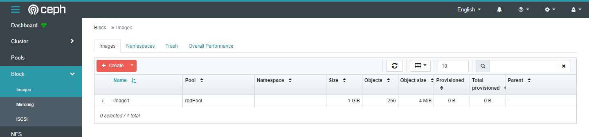
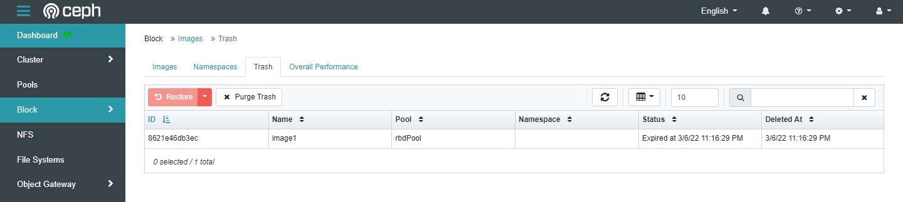

# Ceph concept

## I. Table of contents

- [Ceph concept](#ceph-concept)
  - [I. Table of contents](#i-table-of-contents)
  - [II. Add/remove osd/node](#ii-addremove-osdnode)
    - [1. Add Node OSD](#1-add-node-osd)
    - [2. Add OSD](#2-add-osd)
    - [3. Remove OSD](#3-remove-osd)
    - [4. Remove Node](#4-remove-node)
  - [III. Create/Update/Delete Pool](#iii-createupdatedelete-pool)
    - [1. Create pool](#1-create-pool)
    - [2. Update pool](#2-update-pool)
    - [3. Delete pool](#3-delete-pool)
  - [IV. Create/Update/Delete Image](#iv-createupdatedelete-image)
    - [1. Create Image](#1-create-image)
    - [2. Update Image](#2-update-image)
    - [3. Delete Image](#3-delete-image)
  - [V. Mapping Image to host (client)](#v-mapping-image-to-host-client)
  - [VI. ReWeight OSDs](#vi-reweight-osds)
  - [VII. Crush rule](#vii-crush-rule)
    - [1. Crush rule structure](#1-crush-rule-structure)
    - [2. Create crush rule base on osd](#2-create-crush-rule-base-on-osd)
    - [3. Create crush with device class](#3-create-crush-with-device-class)
  - [VIII. References](#viii-references)

## II. Add/remove osd/node

### 1. Add Node OSD

Ở node mới có 1 disk trống (`sdb`) và cùng trong 1 Network cho các OSD: `enp0s9 - 192.168.224/24` mà ta đã cài trước đấy.

```s
NAME   MAJ:MIN RM  SIZE RO TYPE MOUNTPOINT
sda      8:0    0   48G  0 disk
├─sda1   8:1    0   47G  0 part /
├─sda2   8:2    0    1K  0 part
└─sda5   8:5    0  975M  0 part [SWAP]
sdb      8:16   0   10G  0 disk
sr0     11:0    1 1024M  0 rom

4: enp0s9: <BROADCAST,MULTICAST,UP,LOWER_UP> mtu 1500 qdisc pfifo_fast state UP group default qlen 1000
    link/ether 08:00:27:ac:80:05 brd ff:ff:ff:ff:ff:ff
    inet 192.168.224.13/24 brd 192.168.224.255 scope global dynamic enp0s9
       valid_lft 565sec preferred_lft 565sec
    inet6 fe80::a00:27ff:feac:8005/64 scope link
       valid_lft forever preferred_lft forever
```

Ở node ta đã cài All in One ta sẽ bắt dầu config để cho node mới vào Ceph cluster

```s
source ./cephenv/bin/activate
cd ./ceph-ansible/

# Sửa file này thành như sau
cat group_vars/osds.yml | egrep -v '^#|^$'

---
dummy:
osd_auto_discovery: true

# Thêm node trong file ipNode
vim ipNode

[mons]
mon-node-1 ansible_host=10.0.17.7 ansible_connection=ssh     ansible_user=**** ansible_password=**** ansible_become=true ansible_become_password=****

[osds]
osd-node-1 ansible_host=192.168.224.10 ansible_connection=ssh     ansible_user=**** ansible_password=**** ansible_become=true ansible_become_password=****

osd-node-2 ansible_host=192.168.224.13 ansible_connection=ssh     ansible_user=**** ansible_password=**** ansible_become=true ansible_become_password=****

[monitoring]
mon-node-1

[mgrs]
mon-node-1

# Chạy và chỉ giới hạn ở node osd2
ansible-playbook -i ipNode site.yml.sample --limit osd-node-2
```

Kết quả

```s
# Trên node AIO
ceph osd tree

ID  CLASS  WEIGHT   TYPE NAME                    STATUS  REWEIGHT  PRI-AFF
-1         0.02939  root default
-3         0.01959      host ops-debian-10
 0    hdd  0.00980          osd.0                    up   1.00000  1.00000
 1    hdd  0.00980          osd.1                    up   1.00000  1.00000
-5         0.00980      host ubuntu-ceph-node-2
 2    hdd  0.00980          osd.2                    up   1.00000  1.00000

# Trên node osd-node-2

systemctl status ceph-osd@2

● ceph-osd@2.service - Ceph object storage daemon osd.2
     Loaded: loaded (/lib/systemd/system/ceph-osd@.service; enabled-runtime; vendor preset: enabled)
     Active: active (running) since Sat 2022-03-05 07:37:39 UTC; 23min ago
   Main PID: 19396 (ceph-osd)
      Tasks: 59
     Memory: 37.0M
     CGroup: /system.slice/system-ceph\x2dosd.slice/ceph-osd@2.service
             └─19396 /usr/bin/ceph-osd -f --cluster ceph --id 2 --setuser ceph --setgroup ceph
```

### 2. Add OSD

Ta sẽ thêm 1 disk vào `osd-node-2`.

```s
lsblk

NAME                                                                                               MAJ:MIN RM  SIZE RO TYPE MOUNTPOINT
loop0                                                                                                7:0    0 61.9M  1 loop /snap/core20/1361
loop1                                                                                                7:1    0 55.4M  1 loop /snap/core18/2128
loop2                                                                                                7:2    0 70.3M  1 loop /snap/lxd/21029
loop3                                                                                                7:3    0 55.5M  1 loop /snap/core18/2284
loop4                                                                                                7:4    0 67.9M  1 loop /snap/lxd/22526
loop5                                                                                                7:5    0 43.6M  1 loop /snap/snapd/14978
sda                                                                                                  8:0    0   20G  0 disk
├─sda1                                                                                               8:1    0    1M  0 part
├─sda2                                                                                               8:2    0  1.5G  0 part /boot
└─sda3                                                                                               8:3    0 18.5G  0 part
  └─ubuntu--vg-ubuntu--lv                                                                          253:1    0   10G  0 lvm  /
sdb                                                                                                  8:16   0   10G  0 disk
└─ceph--7e168258--0d06--4633--8876--93e72517490d-osd--block--b64df4c6--aafa--4cea--bdbf--9f446f77e760
                                                                                                   253:0    0   10G  0 lvm
sdc                                                                                                  8:32   0   10G  0 disk
sr0                                                                                                 11:0    1 1024M  0 rom
```

```s
# Sửa file này thành như sau (vì ta chỉ cần thêm osd cho ổ sdc)
cat group_vars/osds.yml | egrep -v '^#|^$'

---
dummy:
devices:
  - /dev/sdc
osd_auto_discovery: false

# Chạy và chỉ giới hạn ở node osd2
ansible-playbook -i ipNode site.yml.sample --limit osd-node-2
```

Kết quả

```s
ceph osd tree

ID  CLASS  WEIGHT   TYPE NAME                    STATUS  REWEIGHT  PRI-AFF
-1         0.03918  root default
-3         0.01959      host ops-debian-10
 0    hdd  0.00980          osd.0                    up   1.00000  1.00000
 1    hdd  0.00980          osd.1                    up   1.00000  1.00000
-5         0.01959      host ubuntu-ceph-node-2
 2    hdd  0.00980          osd.2                    up   1.00000  1.00000
 3    hdd  0.00980          osd.3                    up   1.00000  1.00000
```

### 3. Remove OSD

```s
ceph osd tree

-1         0.03918  root default
-3         0.01959      host ops-debian-10
 0    hdd  0.00980          osd.0                    up   1.00000  1.00000
 1    hdd  0.00980          osd.1                    up   1.00000  1.00000
-5         0.01959      host ubuntu-ceph-node-2
 2    hdd  0.00980          osd.2                    up   1.00000  1.00000
 3    hdd  0.00980          osd.3                    up   1.00000  1.00000

# Để remove osd có id là 3 ta dùng command sau, sử dụng playbook có sẵn
ansible-playbook -vv -i ipNode infrastructure-playbooks/shrink-osd.yml -e osd_to_kill=3
# Nó sẽ hỏi là có chắc là muốn shrink cluster không? Ta nhập là yes.
Are you sure you want to shrink the cluster? [no]:

# Hoặc chạy command sau để không bị hỏi:
ansible-playbook -vv -i ipNode infrastructure-playbooks/shrink-osd.yml -e osd_to_kill=3 -e ireallymeanit=yes
```

Kết quả

```s
ceph osd tree
ID  CLASS  WEIGHT   TYPE NAME                    STATUS  REWEIGHT  PRI-AFF
-1         0.02939  root default
-3         0.01959      host ops-debian-10
 0    hdd  0.00980          osd.0                    up   1.00000  1.00000
 1    hdd  0.00980          osd.1                    up   1.00000  1.00000
-5         0.00980      host ubuntu-ceph-node-2
 2    hdd  0.00980          osd.2                    up   1.00000  1.00000
```

### 4. Remove Node

Ta chỉ cần shrink nốt OSDs còn lại để remove `osd-node-2`.

Kết quả:

```s
ceph osd tree
ID  CLASS  WEIGHT   TYPE NAME                    STATUS  REWEIGHT  PRI-AFF
-1         0.01959  root default
-3         0.01959      host ops-debian-10
 0    hdd  0.00980          osd.0                    up   1.00000  1.00000
 1    hdd  0.00980          osd.1                    up   1.00000  1.00000
-5               0      host ubuntu-ceph-node-2
```

Dù vẫn có host trong osd tree nhưng weight của nó là 0. Ta dùng câu lệnh sau để xoá host.

```s
ceph osd crush rm ubuntu-ceph-node-2

# Kết quả
ceph osd tree
ID  CLASS  WEIGHT   TYPE NAME               STATUS  REWEIGHT  PRI-AFF
-1         0.01999  root default
-3         0.01999      host ops-debian-10
 0    hdd  0.00999          osd.0               up   1.00000  1.00000
 1    hdd  0.00999          osd.1               up   1.00000  1.00000
```

Hoặc ta có thể `edit crush map` manual cũng cho kết quả tương tự. (Xem thêm ở Ref)

## III. Create/Update/Delete Pool

### 1. Create pool

```s
# Câu lệnh
ceph osd pool create <pool-name> <pg-num> <pgp-num> [replicated] \
         [crush-rule-name] [expected-num-objects]

ceph osd pool create firstPool 128 128 replicated
```

Lưu ý: pgp-num **must be equal** to the total number of placement groups, except for placement group splitting scenarios.

Kết quả:

```s
ceph osd lspools

1 device_health_metrics
2 firstPool
```

### 2. Update pool

```s
# Sau khi chúng ta tạo pool xong sẽ thấy PG num của pool là 32, bởi vì mặc định `pg_autoscale_mode` được bật và giá trị `osd_pool_default_pg_num` là 32, ta có thể tắt bằng command
ceph osd pool set <pool-name> pg_autoscale_mode <mode>

ceph osd pool set firstPool pg_autoscale_mode off

# Set lại PG num về 128
ceph osd pool set firstPool pg_num 128

# Đổi lại tên pool
ceph osd pool rename <current-pool-name> <new-pool-name>

ceph osd pool rename firstPool newPool
```

Ngoài ra ta cũng có thể cấu hình chỉ rõ pool này cho application nào để phù hợp với `I/O operations`

```s
ceph osd pool application enable <poolname> <app> {--yes-i-really-mean-it}

ceph osd pool application enable newPool rbd --yes-i-really-mean-it

# Ta cũng có thể disable
ceph osd pool application disable <poolname> <app> {--yes-i-really-mean-it}
```

Trong đó `<app>` có thể là các giá trị

- `cephfs` for the Ceph Filesystem.
- `rbd` for the Ceph Block Device
- `rgw` for the Ceph Object Gateway
- Specify a different `<app>` value for a custom application.

### 3. Delete pool

Để xoá được pool ta phải đặt giá trị sau là true

```s
ceph config set mon mon_allow_pool_delete true
```

Ta cũng có thể sửa giá trị này trong Ceph Dashbroad:


Sau đó ta sẽ tiến hành xoá pool

```s
ceph osd pool delete <pool-name> [<pool-name> --yes-i-really-really-mean-it]

ceph osd pool delete newPool newPool --yes-i-really-really-mean-it
```

## IV. Create/Update/Delete Image

### 1. Create Image

```s
#Đầu tiên phải tạo pool có app là rbd
ceph osd pool create rbdPool 128 128 replicated
ceph osd pool application enable rbdPool rbd --yes-i-really-mean-it

# Để tạo block device image ta dùng câu lệnh 
rbd create IMAGE_NAME --size MEGABYTES --pool POOL_NAME

# Tạo image có tên `image1`, kích thước 1Gb ở trong rbdPool
rbd create image1 --size 1024 --pool rbdPool

# Xem image đã tạo
rbd ls <POOL_NAME>

rbd ls rbdPool
image1
```

Hoặc ta có thể nhìn trong Ceph Dashbroad



Ta có thể lấy info của image bằng CLI command

```s
# Info có id của image
rbd --image IMAGE_NAME -p POOL_NAME info

rbd --image image1 -p rbdPool info
rbd image 'image1':
        size 1 GiB in 256 objects
        order 22 (4 MiB objects)
        snapshot_count: 0
        id: 8611fc9d4b63
        block_name_prefix: rbd_data.8611fc9d4b63
        format: 2
        features: layering, exclusive-lock, object-map, fast-diff, deep-flatten
        op_features:
        flags:
        create_timestamp: Sun Mar  6 23:01:13 2022
        access_timestamp: Sun Mar  6 23:01:13 2022
        modify_timestamp: Sun Mar  6 23:01:13 2022
```

### 2. Update Image

```s
# Thay đổi size của image
rbd resize --image POOL_NAME/IMAGE_NAME --size SIZE

rbd resize --image rbdPool/image1 --size 2048

# Kiểm tra
rbd --image image1 -p rbdPool info
rbd image 'image1':
        size 2 GiB in 512 objects
```

### 3. Delete Image

```s
# Xoá image
rbd rm IMAGE_NAME -p POOL_NAME

rbd rm image1 -p rbdPool
```

Nếu không muốn xoá, ta có thể xoá tạm thời bằng cách chuyển nó vào thùng rác.

```s
# Chuyển image vào thùng rác
rbd trash mv POOL_NAME/IMAGE_NAME

rbd trash mv rbdPool/image1
```

Ta cũng có thể thấy trong Ceph Dashbroad



```s
# Danh sách image trong thùng rác
rbd trash list POOL_NAME

rbd trash list rbdPool
8621e46db3ec image1

# Xoá image khỏi thùng rác
rbd trash rm POOL_NAME/IMAGE_ID

# Restore lại image
rbd trash restore POOL_NAME/IMAGE_ID

rbd trash restore rbdPool/8621e46db3ec

# Xoá hết image của pool trong thùng rác
rbd trash purge POOL_NAME

# Đặt thời gian tự dọn trash image của 1 pool
rbd trash purge schedule add --pool POOL_NAME INTERVAL

rbd trash purge schedule add --pool rbdPool 10m

# list the trash purge schedule
rbd trash purge schedule ls --pool POOL_NAME

rbd trash purge schedule ls --pool rbdPool

# To know the status of trash purge schedule
rbd trash purge schedule status

# To remove the trash purge schedule
rbd trash purge schedule remove --pool POOL_NAME INTERVAL

rbd trash purge schedule remove --pool rbdPool 10m
```

## V. Mapping Image to host (client)

Required: Client đó phải connect được tới `Public Network` và `Cluster Network` của Ceph cluster.

```s
# Trước khi mount
lsblk

NAME                      MAJ:MIN RM  SIZE RO TYPE MOUNTPOINT
loop0                       7:0    0 55.4M  1 loop /snap/core18/2128
loop1                       7:1    0 55.5M  1 loop /snap/core18/2284
loop2                       7:2    0 61.9M  1 loop /snap/core20/1361
loop3                       7:3    0 70.3M  1 loop /snap/lxd/21029
loop4                       7:4    0 67.9M  1 loop /snap/lxd/22526
loop5                       7:5    0 43.6M  1 loop /snap/snapd/14978
sda                         8:0    0   20G  0 disk
├─sda1                      8:1    0    1M  0 part
├─sda2                      8:2    0  1.5G  0 part /boot
└─sda3                      8:3    0 18.5G  0 part
  └─ubuntu--vg-ubuntu--lv 253:0    0   10G  0 lvm  /
sdb                         8:16   0   10G  0 disk
sr0                        11:0    1 1024M  0 rom


# Đầu tiên là cài đặt ceph-common package (bao gồm `systemd` unit file, `rbdmap.service`)
apt install ceph-common

# Sau đó ta phải 2 file Copying Ceph Conf và Keyring sang the client machines
/etc/ceph/ceph.client.admin.keyring
/etc/ceph/ceph.conf

# Tiếp theo ta thêm rbd image bằng cách sửa file sau
vim /etc/ceph/rbdmap
rbdPool/image1    id=admin,keyring=/etc/ceph/ceph.client.admin.keyring

# Hoặc ta cũng có thể dùng command (lúc này nó sẽ không được hiện trong config file)
rbd map rbdPool/image1 --id admin --keyring /etc/ceph/ceph.client.admin.keyring

# Enable the RBD mapping service - making the images get automatically mapped and mounted at boot:
systemctl enable rbdmap.service

# Để unmap tất cả các images ở trong config file
rbdmap unmap

# Để unmap tất cả các images đã mount (dù không hiện trong config file)
rbdmap unmap-all
```

Kết quả:

```s
lsblk

NAME                      MAJ:MIN RM  SIZE RO TYPE MOUNTPOINT
loop0                       7:0    0 55.4M  1 loop /snap/core18/2128
loop1                       7:1    0 55.5M  1 loop /snap/core18/2284
loop2                       7:2    0 61.9M  1 loop /snap/core20/1361
loop3                       7:3    0 70.3M  1 loop /snap/lxd/21029
loop4                       7:4    0 67.9M  1 loop /snap/lxd/22526
loop5                       7:5    0 43.6M  1 loop /snap/snapd/14978
sda                         8:0    0   20G  0 disk
├─sda1                      8:1    0    1M  0 part
├─sda2                      8:2    0  1.5G  0 part /boot
└─sda3                      8:3    0 18.5G  0 part
  └─ubuntu--vg-ubuntu--lv 253:0    0   10G  0 lvm  /
sdb                         8:16   0   10G  0 disk
sr0                        11:0    1 1024M  0 rom
rbd0                      252:0    0    1G  0 disk
```

Ta thấy có thêm ổ rbd0.

```s
# Để có thể truy cập vào devices này ta thêm dòng sau vào /etc/fstab
vim /etc/fstab

/dev/rbd/rbdPool/image1 /mnt/image1 xfs noauto 0 0

# Ngoài ra cũng tạo thư mục mount
mkdir /mnt/image1

# Restart lại services để mount
systemctl restart rbdmap.service

# Kiểm tra mount point
lsblk

NAME                      MAJ:MIN RM  SIZE RO TYPE MOUNTPOINT
loop0                       7:0    0 43.6M  1 loop /snap/snapd/14978
loop1                       7:1    0 70.3M  1 loop /snap/lxd/21029
loop2                       7:2    0 55.4M  1 loop /snap/core18/2128
loop3                       7:3    0 61.9M  1 loop /snap/core20/1361
loop4                       7:4    0 55.5M  1 loop /snap/core18/2284
loop5                       7:5    0 67.9M  1 loop /snap/lxd/22526
sda                         8:0    0   20G  0 disk
├─sda1                      8:1    0    1M  0 part
├─sda2                      8:2    0  1.5G  0 part /boot
└─sda3                      8:3    0 18.5G  0 part
  └─ubuntu--vg-ubuntu--lv 253:0    0   10G  0 lvm  /
sdb                         8:16   0   10G  0 disk
sr0                        11:0    1 1024M  0 rom
rbd0                      252:0    0    1G  0 disk /mnt/image1

# Ta thấy mount thành công, thử tạo file
vim /mnt/image1/hello.txt

# Kết quả
ls /mnt/image1
hello.txt
```

## VI. ReWeight OSDs

```s
# Trước khi ReWeight
ceph osd tree

ID  CLASS  WEIGHT   TYPE NAME                    STATUS  REWEIGHT  PRI-AFF
-1         0.01959  root default
-3         0.00980      host ops-debian-10
 0    hdd  0.00980          osd.0                    up   1.00000  1.00000
-5         0.00980      host ubuntu-ceph-node-1
 1    hdd  0.00980          osd.1                    up   1.00000  1.00000

# Để reweight ta dùng command sau, weight được tính theo Terabyte
ceph osd crush reweight {name} {weight}

ceph osd crush reweight osd.0 0.005

reweighted item id 0 name 'osd.0' to 0.005 in crush map

# Kết quả
ceph osd tree
ID  CLASS  WEIGHT   TYPE NAME                    STATUS  REWEIGHT  PRI-AFF
-1         0.01479  root default
-3         0.00499      host ops-debian-10
 0    hdd  0.00499          osd.0                    up   1.00000  1.00000
-5         0.00980      host ubuntu-ceph-node-1
 1    hdd  0.00980          osd.1                    up   1.00000  1.00000

# Ensure that the CRUSH bucket tree accurately reflects the sum of the leaf OSDs under the bucket
osd crush reweight-all

#  Temporarily increase or decrease the weight of particular OSDs
ceph osd reweight {id} {weight}
  id is the OSD number.
  weight is a range from 0.0-1.0. - where 0 is not in the cluster (that is, it does not have any PGs assigned to it) and 1.0 is in the cluster (that is, the OSD receives the same number of PGs as other OSDs)
```

## VII. Crush rule

### 1. Crush rule structure

```s
rule replicated_rule {
  id 0
  type replicated
  min_size 1
  max_size 10
  step take default
  step chooseleaf firstn 0 type host
  step emit
}
```

Nhìn vào Crush map ta có thể thấy cấu trúc của crush rule gồm 1 số thành phần chính như sau:

- `id`: ID của rule
- `type`: Type của rule. Hiện tại, bắt buộc value phải là `replicated`
- `min_size`: If a pool makes fewer replicas than this number, CRUSH will not select this rule.
- `max_size`: If a pool makes more replicas than this number, CRUSH will not select this rule.
- `step take <bucket-name> [class <class-name>]`: Chọn bucket dựa trên bucket name. Lấy bucket đó là điểm bắt đầu đi xuống các subtree, leaf node ở dưới.
- `step choose firstn <num> type <bucket-type>`: Chọn `num` bucket có type là `bucket-type`, các bucket này sẽ ở dưới bucket bắt đầu. `num` thường là số lượng replicas trong pools:
  - If `<num> == 0`, choose `pool-num-replicas` buckets (all available).
  - If `<num> > 0 && < pool-num-replicas`, choose that many buckets.
  - If `<num> < 0`, it means `pool-num-replicas - {num}`.
- `step chooseleaf firstn <num> type <bucket-type>`: Tập hợp `<num>` các bucket có type là `bucket-type`. **Trong tập hợp đó, chọn 1 trong các leaf node của các bucket**. Số lượng bucket trong tập hợp thường là số lượng replicas trong pools:
  - If `<num> == 0`, choose `pool-num-replicas` buckets (all available).
  - If `<num> > 0 && < pool-num-replicas`, choose that many buckets.
  - If `<num> < 0`, it means `pool-num-replicas - {num}`.
- `step emit`: Typically used at the end of a rule, but may also be used to pick from different trees in the same rule.
  
Vì vậy ta có thể `dịch` rule ở phía trên như sau: Rule có type là replica, min replica là 1 và max là 10. Rule sẽ tìm kiếm bắt đầu từ bucket default, sau đó chọn các bucket dưới nó có type là host. Số lượng chọn bucket là bằng với số lượng replica của pool. Sau khi chọn xong, mỗi bucket được chọn nó sẽ chọn 1 leaf node trong host. Trong trường hợp thông thường, leaf node sẽ là các OSDs. Nó sẽ chọn 1 OSD tối ưu nếu bucket host đó có nhiều OSDS.

Ta có thể kiểm tra `replicated_rule` này từ `rbdPool` đã tạo ở trên:

```s
# Xem osd tree
ceph osd tree

ID  CLASS  WEIGHT   TYPE NAME                    STATUS  REWEIGHT  PRI-AFF
-1         0.02939  root default
-3         0.00980      host ops-debian-10
 0    hdd  0.00980          osd.0                    up   1.00000  1.00000
-5         0.01959      host ubuntu-ceph-node-1
 1    hdd  0.00980          osd.1                    up   1.00000  1.00000
 2    hdd  0.00980          osd.2                    up   1.00000  1.00000

# Lấy ID của pool
ceph osd lspools
1 device_health_metrics
3 rbdPool

# Lấy `Acting set` của từng PG có ID Pool là 3
ceph pg dump | grep '^3\.' | awk '{print $1,$18;}' | nl

dumped all
     1  3.1f [1,0]
     2  3.1e [0,2]
     3  3.1d [2,0]
     4  3.1c [1,0]
     5  3.1b [0,1]
     6  3.1a [1,0]
     7  3.19 [1,0]
     8  3.18 [2,0]
     9  3.17 [1,0]
    10  3.16 [2,0]
    11  3.15 [2,0]
    12  3.14 [1,0]
    13  3.13 [1,0]
    14  3.12 [0,2]
    15  3.11 [2,0]
    16  3.10 [1,0]
    17  3.f [2,0]
    18  3.e [2,0]
    19  3.d [1,0]
    20  3.c [2,0]
    21  3.b [0,1]
    22  3.a [2,0]
    23  3.9 [1,0]
    24  3.8 [2,0]
    25  3.7 [0,1]
    26  3.6 [1,0]
    27  3.5 [2,0]
    28  3.4 [0,2]
    29  3.3 [2,0]
    30  3.1 [0,2]
    31  3.0 [0,2]
    32  3.2 [0,2]
```

Vì pool này có num replica là 2, và số lượng PG là 32 (tự động điều chỉnh, dù lúc tạo là 128). Ta có thấy từng PG và `Acting set` của chúng. Ví dụ PG `3.1f` có `Acting set` là [1,0] nghĩa là primary của nó ở osd.1 còn secondary là ở osd.0. Do `replicated_rule`, phân tán các replica theo host (đã `dịch` rule ở trên), nên bất kể PG nào cũng có osd.0 (vì nó ở host khác osd.1 và osd.2). Nói cách khác `failure domains` ở đây là host. Nếu 1 host bị down thì sẽ còn host còn lại backup.

### 2. Create crush rule base on osd

Từ những điều ở trên, ta hoàn toàn có thể viết 1 rule phân phối các replica theo osd như sau:

```s
rule replicated_osd {
  id 1
  type replicated
  min_size 1
  max_size 10
  step take default
  step choose firstn 0 type osd
  step emit
}
```

Ta `dịch` rule trên như sau: Rule có type là replica, min replica là 1 và max là 10. Rule sẽ tìm kiếm bắt đầu từ bucket default, sau đó chọn các bucket dưới nó có type là osd. Số lượng chọn bucket là bằng với số lượng replica của pool.

Để tránh ảnh hưởng tới cluster, ta có thể dùng công cụ `crushtool` để áp dụng crush này. Ta cũng có thể dùng crushtool tạo 1 crush map `fake` nhưng ở đây ta lấy trực tiếp crush map từ cluster để thử (đã bao gồm osd tree hiện tại).

```s
# Lấy crush map từ cluster hiện tại
ceph osd getcrushmap -o crushmap

# Decomplie crush map
crushtool -d crushmap -o crushmap.txt

# Thêm rule vào crush map
# Lưu ý, Min và max sẽ sửa lại đều là 2. Nếu không khi test, nó sẽ thử từ 1 -> 10, rất dài dòng.
vim crushmap.txt

# Complie crush map
crushtool -c crushmap.txt -o crushmap

# Testing. Min, max trong command này là id của PG, rule 1 là lấy id của rule.
crushtool -i crushmap --test --min-x 1 --max-x 32 --show-mappings | grep 'rule 1'

CRUSH rule 1 x 1 [2,0]
CRUSH rule 1 x 2 [0,1]
CRUSH rule 1 x 3 [0,1]
CRUSH rule 1 x 4 [1,2]
CRUSH rule 1 x 5 [0,2]
CRUSH rule 1 x 6 [0,1]
CRUSH rule 1 x 7 [1,2]
CRUSH rule 1 x 8 [2,0]
CRUSH rule 1 x 9 [2,1]
CRUSH rule 1 x 10 [2,0]
CRUSH rule 1 x 11 [1,2]
CRUSH rule 1 x 12 [0,2]
CRUSH rule 1 x 13 [2,0]
CRUSH rule 1 x 14 [0,2]
CRUSH rule 1 x 15 [0,1]
CRUSH rule 1 x 16 [1,0]
CRUSH rule 1 x 17 [1,0]
CRUSH rule 1 x 18 [0,1]
CRUSH rule 1 x 19 [2,0]
CRUSH rule 1 x 20 [2,0]
CRUSH rule 1 x 21 [1,2]
CRUSH rule 1 x 22 [1,0]
CRUSH rule 1 x 23 [2,0]
CRUSH rule 1 x 24 [0,1]
CRUSH rule 1 x 25 [1,0]
CRUSH rule 1 x 26 [0,2]
CRUSH rule 1 x 27 [1,0]
CRUSH rule 1 x 28 [0,2]
CRUSH rule 1 x 29 [0,1]
CRUSH rule 1 x 30 [2,0]
CRUSH rule 1 x 31 [2,0]
CRUSH rule 1 x 32 [2,0]
```

Từ kết quả này, ta thấy không phải PG nào cũng có osd.0. Ví dụ như ở PG 4, `Acting set` của nó là [1,2]. Do đó, các replica đã được phân phối theo từng osd. Không theo host.

Tiếp theo, ta sẽ thử trực tiếp trong cluster.

```s
# Command tạo Replicated Rule - CRUSH rule for a replicated pool
ceph osd crush rule create-replicated <name> <root> <failure-domain> <class>

# Command tạo Erasure Code Rule - CRUSH rule for use with an erasure coded pool
ceph osd crush rule create-erasure {rulename} {profilename}

# Ngoài ra còn có tạo simple rule mà ta sẽ không đề cập ở đây.
```

Trong đó:

- `<name>`: The name of the rule.
- `<root>`: The root of the CRUSH hierarchy.
- `<failure-domain>`: The failure domain. For example: host or rack.
- `<class>`: The storage device class. For example: hdd or ssd.

Nếu ta muốn sửa chi tiết rule, ta có thể tạo rule sau đó decomplie ra crushmap, edit, recomplie và gán lại crushmap và cluster. (Xem thêm ở `Editing a CRUSH Map manual`)

```s
# Tạo rule phân phối replica theo từng osd
ceph osd crush rule create-replicated replicated_osd default osd

# List rule
ceph osd crush rule ls

replicated_rule
replicated_osd

# Tạo pool dựa trên crush rule
ceph osd pool create osd_Replica_Pool 32 32 replicated replicated_osd
```

Kết quả:

```s
# Lấy ID của pool
ceph osd lspools

1 device_health_metrics
3 rbdPool
7 osd_Replica_Pool

# Lấy `Acting set` của từng PG có ID Pool là 7
ceph pg dump | grep '^7\.' | awk '{print $1,$18;}' | nl

dumped all
     1  7.1b [0,2]
     2  7.1a [2,1]
     3  7.19 [1,2]
     4  7.18 [0,1]
     5  7.1f [2,1]
     6  7.1e [0,2]
     7  7.1d [1,0]
     8  7.1c [2,0]
     9  7.13 [2,0]
    10  7.12 [1,0]
    11  7.11 [2,1]
    12  7.10 [1,2]
    13  7.17 [1,2]
    14  7.16 [1,2]
    15  7.15 [2,0]
    16  7.14 [0,2]
    17  7.b [0,2]
    18  7.a [0,2]
    19  7.9 [0,1]
    20  7.8 [0,1]
    21  7.f [0,1]
    22  7.e [0,1]
    23  7.d [1,0]
    24  7.c [2,0]
    25  7.3 [0,2]
    26  7.2 [0,1]
    27  7.1 [2,1]
    28  7.0 [1,0]
    29  7.7 [1,2]
    30  7.5 [2,0]
    31  7.4 [0,1]
    32  7.6 [0,2]
```

Ta thấy không phải PG nào cũng có osd.0. Ví dụ như ở PG 7.10, `Acting set` của nó là [1,2]. -> các replica đã được phân phối theo từng osd -> Không theo host.

### 3. Create crush with device class

```s
# Trước khi đổi device class
ceph osd tree
ID  CLASS  WEIGHT   TYPE NAME                    STATUS  REWEIGHT  PRI-AFF
-1         0.02939  root default
-3         0.00980      host ops-debian-10
 0    hdd  0.00980          osd.0                    up   1.00000  1.00000
-5         0.01959      host ubuntu-ceph-node-1
 1    hdd  0.00980          osd.1                    up   1.00000  1.00000
 2    hdd  0.00980          osd.2                    up   1.00000  1.00000

# Xoá device class cũ
ceph osd crush rm-device-class osd.1 osd.2
done removing class of osd(s): 1,2

ceph osd tree

ID  CLASS  WEIGHT   TYPE NAME                    STATUS  REWEIGHT  PRI-AFF
-1         0.02939  root default
-3         0.00980      host ops-debian-10
 0    hdd  0.00980          osd.0                    up   1.00000  1.00000
-5         0.01959      host ubuntu-ceph-node-1
 1         0.00980          osd.1                    up   1.00000  1.00000
 2         0.00980          osd.2                    up   1.00000  1.00000

# Gán device class mới
ceph osd crush set-device-class ssd osd.1 osd.2

ceph osd tree

ID  CLASS  WEIGHT   TYPE NAME                    STATUS  REWEIGHT  PRI-AFF
-1         0.02939  root default
-3         0.00980      host ops-debian-10
 0    hdd  0.00980          osd.0                    up   1.00000  1.00000
-5         0.01959      host ubuntu-ceph-node-1
 1    ssd  0.00980          osd.1                    up   1.00000  1.00000
 2    ssd  0.00980          osd.2                    up   1.00000  1.00000
```

Tiếp theo ta sẽ thử tạo rule có failure domain là osd và chỉ phân phối replica trên các ssd osd.

```s
# Tạo rule phân phối replica theo từng osd, device class là ssd
ceph osd crush rule create-replicated replicated_osd_ssd default osd ssd

# List rule
ceph osd crush rule ls

replicated_rule
replicated_osd
replicated_osd_ssd

# Đổi crush rule của osd_Replica_Pool
ceph osd pool set osd_Replica_Pool crush_rule replicated_osd_ssd
```

Kết quả:

```s
# Lấy ID của pool
ceph osd lspools

1 device_health_metrics
3 rbdPool
7 osd_Replica_Pool

# Lấy `Acting set` của từng PG có ID Pool là 7
ceph pg dump | grep '^7\.' | awk '{print $1,$18;}' | nl

dumped all
     1  7.1b [2,1]
     2  7.1a [2,1]
     3  7.19 [1,2]
     4  7.18 [1,2]
     5  7.1f [2,1]
     6  7.1e [1,2]
     7  7.1d [1,2]
     8  7.1c [2,1]
     9  7.13 [2,1]
    10  7.12 [1,2]
    11  7.11 [2,1]
    12  7.10 [1,2]
    13  7.17 [1,2]
    14  7.16 [1,2]
    15  7.15 [2,1]
    16  7.14 [1,2]
    17  7.b [1,2]
    18  7.a [2,1]
    19  7.9 [2,1]
    20  7.8 [2,1]
    21  7.f [1,2]
    22  7.e [2,1]
    23  7.d [1,2]
    24  7.c [2,1]
    25  7.3 [2,1]
    26  7.2 [2,1]
    27  7.1 [2,1]
    28  7.0 [1,2]
    29  7.7 [1,2]
    30  7.5 [2,1]
    31  7.4 [1,2]
    32  7.6 [1,2]
```

Ta thấy trong tất cả `Acting set`, đều là các osd có class là ssd.

------------

## VIII. References

[Adding osd(s)](https://docs.ceph.com/projects/ceph-ansible/en/latest/day-2/osds.html)

[NTP Server : Configure NTP Server (Chrony)](https://www.server-world.info/en/note?os=Ubuntu_20.04&p=ntp&f=2)

[How to Install NTP Using Chrony in Linux](https://linuxhint.com/install-ntp-using-chrony-linux/)

[2.9. Editing a CRUSH Map](https://access.redhat.com/documentation/en-us/red_hat_ceph_storage/5/html/storage_strategies_guide/crush_administration#editing_a_crush_map)

[2.2.4. Removing a Bucket](https://access.redhat.com/documentation/en-us/red_hat_ceph_storage/5/html/storage_strategies_guide/crush_administration#removing_a_bucket)

[4.3. Create a Pool](https://access.redhat.com/documentation/en-us/red_hat_ceph_storage/5/html/storage_strategies_guide/pools-1#create_a_pool)

[3.4.3. Setting placement group auto-scaling modes](https://access.redhat.com/documentation/en-us/red_hat_ceph_storage/5/html/storage_strategies_guide/placement_groups_pgs#setting-placement-group-auto-scaling-modes)

[2.4. Creating a block device image](https://access.redhat.com/documentation/en-us/red_hat_ceph_storage/5/html/block_device_guide/ceph-block-devices#creating-a-block-device-image_block)

[2.14. The rbdmap service](https://access.redhat.com/documentation/en-us/red_hat_ceph_storage/5/html/block_device_guide/ceph-block-devices#configuring-the-rbdmap-service_block)

[RBDMAP – MAP RBD DEVICES AT BOOT TIME](https://docs.ceph.com/en/latest/man/8/rbdmap/)

[KB450234 – Mapping RBD Images](https://knowledgebase.45drives.com/kb/kb450234-mapping-ceph-rbd-images/)

[Difference Between 'Ceph Osd Reweight' and 'Ceph Osd Crush Reweight'](https://ceph.io/en/news/blog/2014/difference-between-ceph-osd-reweight-and-ceph-osd-crush-reweight/)

[CRUSHTOOL – CRUSH MAP MANIPULATION TOOL](https://docs.ceph.com/en/latest/man/8/crushtool/)
