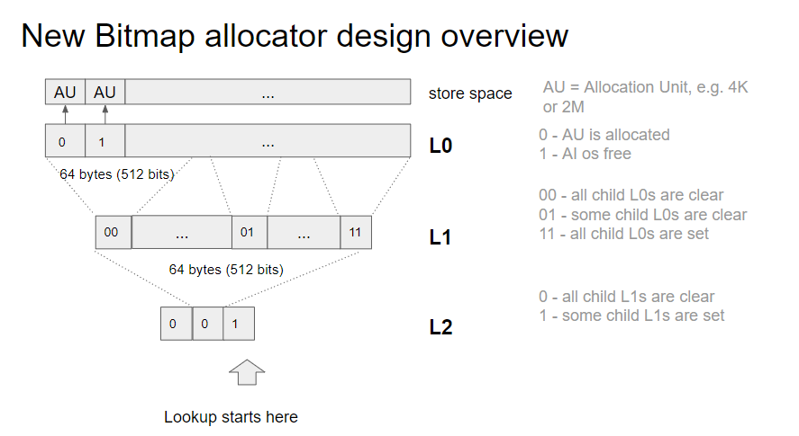
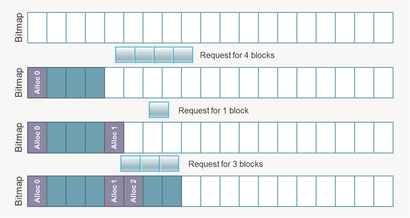
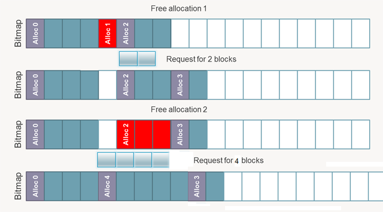
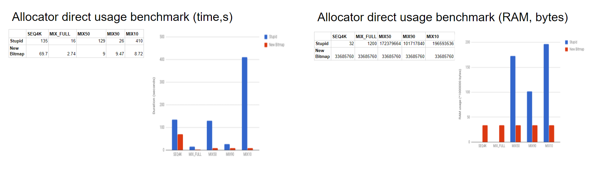
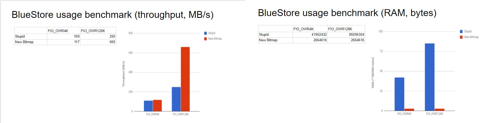

# Ceph concept

## I. Table of contents

- [Ceph concept](#ceph-concept)
  - [I. Table of contents](#i-table-of-contents)
  - [II. Allocator](#ii-allocator)
    - [1. Bitmap allocator](#1-bitmap-allocator)
    - [2. Stupid allocator](#2-stupid-allocator)
    - [3. Performance comparison Stupid and Bitmap allocator](#3-performance-comparison-stupid-and-bitmap-allocator)
    - [4. Another allocator](#4-another-allocator)
  - [III. Config Allocator](#iii-config-allocator)
  - [V. References](#v-references)

## II. Allocator

Allocator hiểu đơn giản là 1 chương trình phân bổ dữ liệu lên memory hay disk. Mỗi 1 allactor khác nhau sẽ sử dụng 1 thuật toán phân bổ khác nhau cho memory và disk.

### 1. Bitmap allocator

Là 1 allocator mới và mặc định cho BlueStore và BlueStoreFS của Ceph.



Các blocksize (mặc định có kích thước 4K) sẽ được lưu trạng thái 0 hoặc 1 ở trong 1 bitmap L0. Do đó, với 1 ổ đĩa 1Tb bitmap L0 chiếm ~ 33mb bộ nhớ. Tiếp đó, bitmap L1 sẽ lưu trạng thái mỗi 64 bytes của bitmap L0 tương ứng. Và cuối cùng bitmap L2 lưu trạng thái mỗi 64 bytes của bitmap L1. Khi ta tìm kiếm các block trống, ta sẽ bắt đầu tìm kiếm phần tử đầu tiên của L2 -> Tìm kiếm từ đầu của disk.

Ta sẽ nhìn kỹ hơn ở những ảnh dưới để để biết tìm kiếm từ đầu của disk đem lại những lợi ích gì?

**Allocation** (Phân bổ)

Đối với công việc Allocation ta sẽ có các bước sau:

- Tính số lượng block cần dùng (làm tròn lên).
- Tìm kiếm từ đầu bitmap, phát hiện ra vị trí phù hợp với số lượng block.
- `Dịch` từ bitmap address sang bên disk hoặc memory address tương ứng.
- Đánh dấu block đã được sử dụng trong bitmap, và cũng đánh dấu block đầu tiên là `boundary block` (block ranh giới).



**Freeing** (Giải phóng)

Giải phóng bộ nhớ trong bitmap allocator ta sẽ làm như sau:

- Kiểm tra boundary block cần xóa có tồn tại hay không.
- Nếu có ta sẽ bắt đầu xóa từ boundary block đến khi nào gặp boundary block tiếp theo hoặc cuối bitmap.



Và sau khi xóa xong, khi ta cần phân bổ thêm block, ta sẽ tìm từ đầu bitmap và chọn ra vị trí còn trống thích hợp.

### 2. Stupid allocator

Là 1 allocator cũ của BlueStore và BlueStoreFS của Ceph. Thay vì lưu trong bitmap thì stupid allocator lưu trữ trong B-Tree. Điều này sẽ tiết kiệm bộ nhớ khi số lượng block quản lý còn ít. Nhưng tuy nhiên cùng ổ đĩa có kích thước bằng nhau thì kích thước của bitmap sẽ không thay đổi (vì nó cố định từ đầu), kích thước của B-tree sẽ tăng dần tùy thuộc vào số lượng block quản lý, và nếu dùng toàn bộ block thì kích thước của nó sẽ hơn bitmap.

Ngoài ra, việc phân bổ sử dụng block nào, thì nó sẽ tìm kiếm từ vị trí cuối cùng được phân bổ (khác với tìm kiếm từ đầu như bitmap). Điều này sẽ gây lãng phí và dễ gây ra việc phân mảnh ổ đĩa hơn so với bitmap.

### 3. Performance comparison Stupid and Bitmap allocator

**Direct benchmark**. Khi benchmark trực tiếp ta có thể dễ dàng thấy, thời gian hoàn thành của Bitmap hơn đáng kể so với Stupid. Đối với việc sử dụng bộ nhớ thì của Bitmap luôn cố định và có thể dễ dàng tính toán trước, trong khi Stupid khá linh hoạt khi ban đầu chỉ sử dụng 32 byte bộ nhớ, nhưng khi phân bổ block tới 90% thì bộ nhớ chiếm nhiếu hơn so với Bitmap.



**BlueStore benchmark**. Khi benchmark qua BlueStore thì kết quả gần như tương tự. Throughput của bitmap lớn hơn và bộ nhớ sử dụng ít hơn so với Bitmap.



### 4. Another allocator

Trong phiên bản Nautilus mới của Ceph, BlueStore và BlueStoreFS đã hỗ trợ thêm các Allocator khác như `Hybrid`, `av1` v.v. Mặc định trong version này là `hybrid`.

```cc
<!-- github.com/ceph/ceph/blob/nautilus-release/src/common/options.cc -->

Option("bluefs_allocator", Option::TYPE_STR, Option::LEVEL_DEV)
    .set_default("hybrid")
    .set_enum_allowed({"bitmap", "stupid", "avl", "hybrid"})
    .set_description(""),
Option("bluefs_allocator", Option::TYPE_STR, Option::LEVEL_DEV)
    .set_default("hybrid")
    .set_enum_allowed({"bitmap", "stupid", "avl", "hybrid"})
    .set_description(""),
```

Ngoài ra trong các filesystem khác nhau cũng sử dụng Allocator khác nhau. Ví dụ như ext2 và ext3 sử dụng bitmap allocator nhưng đến ext4 thì lại sử dụng multiblock allocation (mballoc). Nó sẽ phân bổ nhiều block trong 1 lần duy nhất, giúp tiếp kiệm tài nguyên CPU, tìm ra vị trí block tốt nhất để lưu trữ và từ đó giảm phân mảnh ổ đĩa.

## III. Config Allocator

Trên phiên bản Nautilus mặc định allocator là Hybrid. Đối với các phiên bản cũ hơn như Luminous v12.2.x và Mimic v13.2.x thì mặc định allocator vẫn là Stupid và chưa support Bitmap. Tuy nhiên từ phiên bản stable đầu tiên Luminous v12.2.0 và Mimic v13.2.0 thì Bitmap allocator đã được implement vào nhưng phải đến phiên bản Luminous v12.2.13 và Mimic v13.2.7 mới được đặt sử dụng mặc định.

Ta có thể config Ceph như sau để sử dụng bitmap:

```s
[osd]
bluestore_allocator = bitmap
bluefs_allocator = bitmap
```

------------

## V. References

[New in Nautilus: RADOS Highlights](https://ceph.io/community/new-in-nautilus-rados-highlights/)

[BlueStore Stupid vs. new Bitmap allocator performance comparison](https://docs.google.com/presentation/d/1_1Otkgv76fbCU2Zogjz748sEAG-1Nfiidbb6mgTON-A/edit#slide=id.p)

[3.7. RADOS](https://access.redhat.com/documentation/en-us/red_hat_ceph_storage/3.3/html/release_notes/enhancements)

[Linux - Frequently Asked Questions](https://ext4.wiki.kernel.org/index.php/Frequently_Asked_Questions#What_is_the_bitmap_allocator.3F)

[Memory Management from the Ground Up 2: Bitmap Allocator](https://eatplayhate.me/2010/09/04/memory-management-from-the-ground-up-2-foundations/)

[BlueStore bitmap allocator under Luminous and Mimic](http://lists.ceph.com/pipermail/ceph-users-ceph.com/2019-April/034299.html)

[CEPH RELEASES (INDEX)](https://docs.ceph.com/en/latest/releases/)
